# 09. 状態遷移図（State Machines）

> **目的**：Megrum の主要エンティティのライフサイクルと状態遷移ルールを定義。
> 実装が状態遷移でブレないための一次資料。デザイン・実装・QA の共通言語。

最終更新: 2026-06-29
ステータス: Draft v1.95（iter1226.112 評価・通報・ブロック・モデレーションの法務前提を追記）

---

## このドキュメントの使い方

- **記法**: mermaid（GitHub / VS Code / Mermaid Live でレンダリング可）
- **状態識別子**: `snake_case`（実装でも同じ識別子を使う）
- **トリガー**: `from → to` の遷移を起こすユーザー操作 or システムイベント
- **ビジネスルール**: 状態遷移に紐づく時間・SLA・前提条件

## 更新ルール

1. デザイン or 仕様変更で**状態の追加・削除・名称変更**があった場合、必ず該当箇所を更新する
2. 状態識別子は実装と完全一致させる（`agreed` を `agreement_complete` に勝手に変えない）
3. mermaid記法のエラーが出たら、Mermaid Live ([https://mermaid.live](https://mermaid.live)) で確認
4. 各セクション末尾の「関連画面」と「関連ファイル」を必ず併記し、cross-reference を保つ

## 目次

1. [Proposal Lifecycle（打診〜合意）](#1-proposal-lifecycle)
2. [Deal Lifecycle（合意〜完了）](#2-deal-lifecycle)
3. [Dispute Lifecycle（異議申し立て）](#3-dispute-lifecycle)
4. [AW Lifecycle（活動予定）](#4-aw-lifecycle)
5. [Item Lifecycle（在庫アイテム）](#5-item-lifecycle)
6. [Wish Lifecycle](#6-wish-lifecycle)
7. [Account Lifecycle](#7-account-lifecycle)
8. [Listing Lifecycle（個別募集 / iter64〜）](#8-listing-lifecycle)
9. [Calendar Disclosure（カレンダー公開 / iter65〜）](#9-calendar-disclosure)
10. [Local Mode（現地モード / iter63〜）](#10-local-mode)
11. [Meguri Message Lifecycle（めぐりメッセージ）](#11-meguri-message-lifecycle)
12. [Groom Lifecycle（グルーム）](#12-groom-lifecycle)
13. [Meguri Board Lifecycle（チャットルーム）](#13-meguri-board-lifecycleチャットルーム)
14. [Admin / Billing Lifecycle（管理者・有料権限）](#14-admin--billing-lifecycle管理者有料権限)
15. [付録：エンティティ間の関係](#15-付録エンティティ間の関係)

---

## 1. Proposal Lifecycle

打診（提案）の作成から、合意成立または terminal state まで。
合意成立（`agreed`）後は **Deal Lifecycle** に引き継がれる。

### 状態図

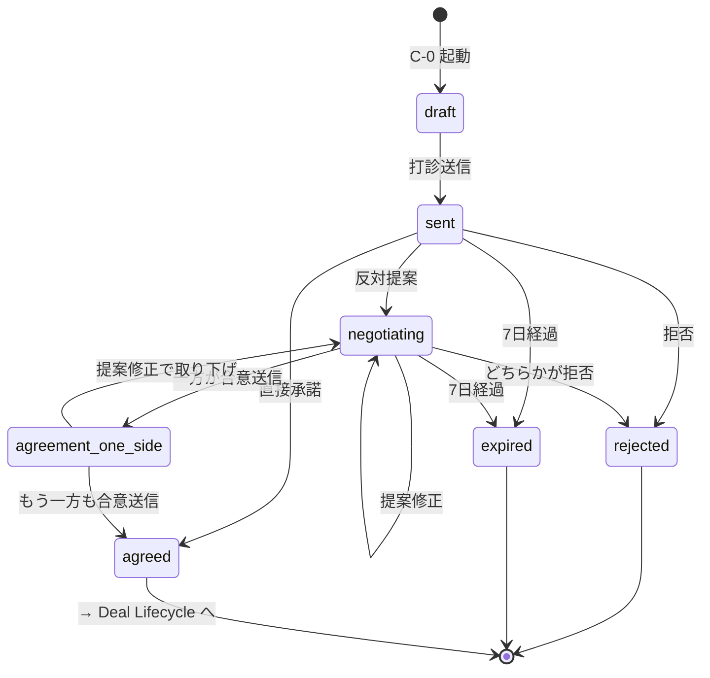
```mermaid
stateDiagram-v2
    [*] --> draft: C-0 起動
    draft --> sent: 打診送信

    sent --> rejected: 拒否
    sent --> agreed: 直接承諾
    sent --> negotiating: 反対提案
    sent --> expired: 7日経過

    negotiating --> negotiating: 提案修正
    negotiating --> rejected: どちらかが拒否
    negotiating --> agreement_one_side: 一方が合意送信
    negotiating --> expired: 7日経過

    agreement_one_side --> agreed: もう一方も合意送信
    agreement_one_side --> negotiating: 提案修正で取り下げ

    rejected --> [*]
    expired --> [*]
    agreed --> [*]: → Deal Lifecycle へ
```

### 状態定義

| 状態 ID | 表示名 | 意味 | 主画面 |
|---|---|---|---|
| `draft` | 下書き | C-0 で編集中（DBには未登録 or `status=draft`） | C-0 |
| `sent` | 送信済 | 受諾者の判断待ち | C-1 受信側 |
| `negotiating` | ネゴ中 | 提案修正のやりとり中 | C-1.5 |
| `agreement_one_side` | 一方合意済 | 一方が合意送信、他方待ち | C-1.5（mine-agreed scenario） |
| `agreed` | 合意済 | 双方合意・取引成立 | → Deal Lifecycle |
| `rejected` | 拒否済 | terminal | — |
| `expired` | 期限切れ | terminal、再打診で新規作成 | C-1.5（expired scenario） |

### 主要トリガー

| from → to | トリガー | 主体 | 画面 |
|---|---|---|---|
| `[*] → draft` | C-0 起動（マッチカードから「打診する」） | 提案者 | ホーム → C-0 |
| `draft → sent` | 「打診を送る」CTA | 提案者 | C-0 |
| `sent → agreed` | 「承諾する」 | 受諾者 | C-1 受信 |
| `sent → rejected` | 「拒否する」 | 受諾者 | C-1 受信 |
| `sent → negotiating` | 「反対提案する」 | 受諾者 | C-1 受信 |
| `negotiating → agreement_one_side` | 「合意して受諾」→確認モーダルOK | どちらか | C-1.5 |
| `agreement_one_side → agreed` | 残った片方も「合意して受諾」 | 残った人 | C-1.5 |
| `* → expired` | 最終アクションから 7日経過 | システム | バックグラウンド |

### ビジネスルール

- **期限**: 各「最新提案バージョン」から 7日経過で `expired`
- **延長**: `negotiating` ステートでのみ「+7日延長」可能、何回でも（iter30）
- **リマインド**: 3日目（lavender系バナー）と 6日目（warn系バナー）に通知＋画面内バナー
- **提案修正**: `negotiating` 中の提案修正でも 7日カウントは**継続**（リセットしない）　※要確認
- **再開**: `expired` から再度打診したい場合は新規 `draft` 作成
- **24時間無応答での自動拒否は廃止**（旧仕様、iter30）
- **市場残数の確保（iter153 / iter586）**: `agreed` に到達した時点で、`sender_have_ids` / `receiver_have_ids` の数量を `goods_inventory.locked_qty` として市場残数から差し引く。マイ在庫の表示数量はこの時点では減らさず、取引完了承認時に実在庫 `quantity` を減算する。
- **キャパ超過防止（iter153 / iter586）**: `agreed` へ遷移する直前に、双方の譲在庫について `quantity - locked_qty >= proposal qty` を満たすことを行ロック付きRPCで検証する。不足している場合は合意成立させない。
- **交換手段（iter168.71, iter168.82）**: Proposal は `exchange_method='hand'`（現地交換）、`exchange_method='mail'`（郵送交換）、`exchange_method='both'`（現地・郵送どちらも対応可）を持つ。
- **現地交換の入力条件**: `exchange_method='hand'` または `exchange_method='both'` の時は、送信前に待ち合わせの入力を必須とする。
- **郵送交換の入力条件**: `exchange_method='mail'` または `exchange_method='both'` の時は、送信者が住所登録済みであることを送信前に確認する。受信者も合意までに住所登録が必要。
- **住所の開示タイミング**: 住所は `agreed` になるまで相手へ見せず、合意後に当事者同士だけへ表示する。
- **合意時の交換手段固定（iter168.97）**: `exchange_method='both'` の打診に応じる時は、合意前に `hand` または `mail` のどちらか1つを選び、選択した値で Proposal を固定する。
- **合意時の待ち合わせ候補固定（iter168.97）**: 現地交換で候補が複数ある場合は、合意前に候補を1つ選び、選択候補を `meetup_start_at/end_at/place_name/lat/lng` と `meetup_candidates` にミラーする。
- **逆打診 / 再打診（iter168.97）**: 条件を変えたい場合は、元 Proposal の提示物・受け取り候補・待ち合わせ候補・交換手段をコピーした新しい打診作成画面へ遷移し、元 Proposal を直接 mutate しない。

### 関連画面

- C-0 提示物選択（draft 編集）
- C-1 打診送信／受信
- C-1.5 ネゴチャット（normal / reminder3 / reminder6 / expired / mine-agreed）
- 合意確認モーダル（agreement_one_side 直前）
- 取引成立画面（agreed 直後）

### 関連ファイル

- `Megrum/propose-select.jsx`
- `Megrum/c-flow.jsx`（C-1）
- `Megrum/nego-flow.jsx`（C-1.5、合意確認、成立画面）

---

## 2. Deal Lifecycle

合意成立した取引の、当日〜完了まで。
入口は Proposal Lifecycle の `agreed`、出口は `completed`（Swift Native現行の完了状態）/ `rated`（評価済みの概念状態）または `cancelled`、または `disputed`（→ Dispute Lifecycle）。
現行の図は **現地交換フローを主軸** にしており、郵送交換は当面ビジネスルールで扱う。発送済み / 受取済み の専用状態を切るかは未確定。
Swift Native版では `approved` を `proposals.approved_by_sender` / `approved_by_receiver` のboolで表現し、両方trueになった時点で `proposals.status='completed'` にする。評価済みかどうかは `user_evaluations` の投稿有無で判定する。

### 状態図

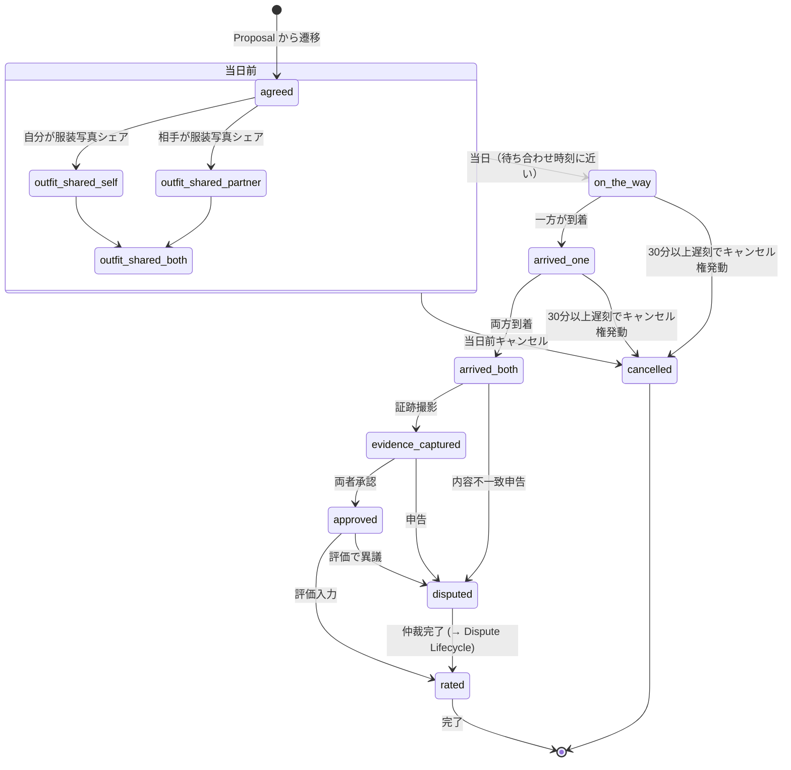
```mermaid
stateDiagram-v2
    [*] --> agreed: Proposal から遷移

    state "当日前" as pre {
      agreed --> outfit_shared_self: 自分が服装写真シェア
      agreed --> outfit_shared_partner: 相手が服装写真シェア
      outfit_shared_self --> outfit_shared_both
      outfit_shared_partner --> outfit_shared_both
    }

    pre --> on_the_way: 当日（待ち合わせ時刻に近い）
    on_the_way --> arrived_one: 一方が到着
    arrived_one --> arrived_both: 両方到着

    arrived_both --> evidence_captured: 証跡撮影
    evidence_captured --> approved: 両者承認
    approved --> rated: 評価入力
    rated --> [*]: 完了

    pre --> cancelled: 当日前キャンセル
    on_the_way --> cancelled: 30分以上遅刻でキャンセル権発動
    arrived_one --> cancelled: 30分以上遅刻でキャンセル権発動

    arrived_both --> disputed: 内容不一致申告
    evidence_captured --> disputed: 申告
    approved --> disputed: 評価で異議

    disputed --> rated: 仲裁完了 (→ Dispute Lifecycle)
    cancelled --> [*]
```

### 状態定義

| 状態 ID | 表示名 | 意味 |
|---|---|---|
| `agreed` | 合意済 | 取引成立、当日待ち |
| `outfit_shared_self` | 自分のみ服装写真済 | 部分状態 |
| `outfit_shared_partner` | 相手のみ服装写真済 | 部分状態 |
| `outfit_shared_both` | 両者服装写真済 | 部分状態 |
| `on_the_way` | 移動中 | 当日に現在地共有開始 |
| `arrived_one` | 一方到着 | 片方が会場到着 |
| `arrived_both` | 両者到着 | 合流可能 |
| `evidence_captured` | 証跡撮影済 | 交換後の証跡画像がアップロード済み。複数枚可 |
| `approved` | 両者承認済 | 内容OK |
| `completed` | 完了 | Swift Native現行のterminal状態 |
| `rated` | 評価済 | 完了後に評価投稿済みであることを示す概念状態 |
| `disputed` | dispute中 | → Dispute Lifecycle |
| `cancelled` | キャンセル済 | terminal |

### ビジネスルール

- **服装写真共有**: 任意だが推奨。C-2 で目立つCTA（iter34）
- **現在地共有**: 任意だが当日推奨（iter34）
- **遅刻SLA**: 待ち合わせ時刻から30分超過で相手側にキャンセル権発動（iter20）
- **本人確認**: QRコード相互スキャン（C-2 ヘッダーから）
- **証跡撮影レイアウト**: 「左=相手 / 右=自分」固定（初期設計）。Swift Native現行UIでは複数の証跡画像を一覧表示し、画像タップで全画面確認する。
- **両者承認**: 証跡画像ごとに双方ともOKになり、全画像の承認がそろうと `approved`。片方NGで `disputed`
- **評価**: 1-5 stars＋コメント、片方が先でもOK、両者完了で `rated`
- **評価コメントの法務前提（iter1226.112）**: 評価コメントはユーザー入力UGCであり、プロフィール評価一覧や取引チャット内カードに表示され得る。`rated` は評価投稿済みの概念状態であり、本人確認、安全確認、信用保証、支払能力確認、商品品質保証、真実性確認又は運営推薦を示すstateではない。

### 関連画面

- C-2 取引チャット（agreed〜arrived_both）
- C-3 証跡撮影（evidence_captured 直前）
- C-3 両者承認（approved 直前）
- C-3 評価（rated 直前）

### 関連ファイル

- `Megrum/c-flow.jsx`（C-2 ChatScreen, C-3 CompleteScreen）

---

## 3. Dispute Lifecycle

取引異常時の異議申し立てフロー（D-flow）。

### 状態図

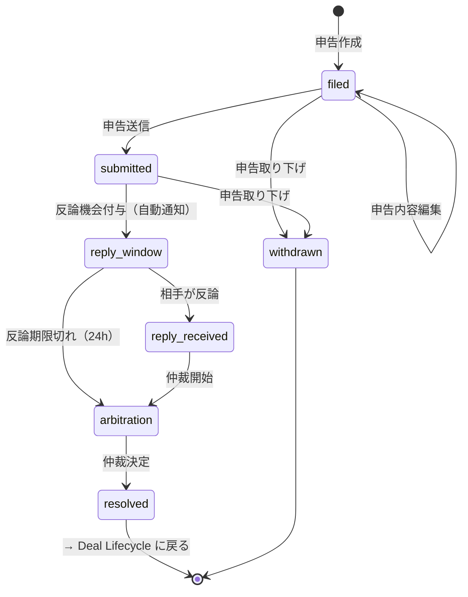
```mermaid
stateDiagram-v2
    [*] --> filed: 申告作成
    filed --> filed: 申告内容編集
    filed --> submitted: 申告送信
    filed --> withdrawn: 申告取り下げ

    submitted --> reply_window: 反論機会付与（自動通知）
    submitted --> withdrawn: 申告取り下げ

    reply_window --> reply_received: 相手が反論
    reply_window --> arbitration: 反論期限切れ（24h）

    reply_received --> arbitration: 仲裁開始
    arbitration --> resolved: 仲裁決定
    resolved --> [*]: → Deal Lifecycle に戻る

    withdrawn --> [*]
```

### 状態定義

| 状態 ID | 表示名 | 意味 |
|---|---|---|
| `filed` | 申告作成中 | 下書き |
| `submitted` | 申告送信済 | 反論待ち |
| `reply_window` | 反論機会期間 | 24h or 4h |
| `reply_received` | 反論受領 | 仲裁前 |
| `arbitration` | 仲裁中 | 運営対応 |
| `resolved` | 仲裁決定済 | → Deal Lifecycle |
| `withdrawn` | 申告取り下げ | terminal |

### ビジネスルール

- **5種カテゴリ**: ドタキャン／遅刻／不一致／破損／その他（iter12）
- **仲裁SLA**: 当日4h、それ以外24h（iter13）
- **凍結**: 申告中は両者とも新規打診不可（iter14、共に新規のみ）
- **反論機会付与**: submit と同時に相手に通知（iter15）
- **受付番号**: 採番（iter16）
- **24h残時間カウンタ**: 表示（iter17）
- **書き方のコツ**: filing 時にアドバイス表示（iter18）
- **法務前提（iter1226.112）**: `disputes.status` や仲裁結果は運営上の処理状態/対応記録であり、裁判、行政救済、警察/消防/医療機関、法律相談、損害賠償、返金、補償、エスクロー、強制執行の代替ではない。最終的な法的責任、真実性、商品価値、信用又は安全性を確定するstateとして扱わない。

### 関連画面

- D-flow（10画面、c-dispute.jsx）

### 関連ファイル

- `Megrum/c-dispute.jsx`
- `Megrum/Megrum Dispute Flow _standalone_.html`

---

## 4. AW Lifecycle

Activity Window = 「私はこの時間ここにいる」予定。場所＋時間枠。

### 状態図

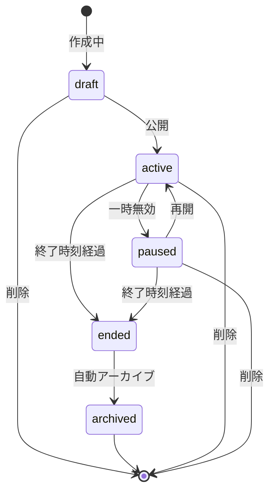
```mermaid
stateDiagram-v2
    [*] --> draft: 作成中
    draft --> active: 公開
    draft --> [*]: 削除

    active --> paused: 一時無効
    paused --> active: 再開

    active --> ended: 終了時刻経過
    paused --> ended: 終了時刻経過

    ended --> archived: 自動アーカイブ
    archived --> [*]

    active --> [*]: 削除
    paused --> [*]: 削除
```

### 状態定義

| 状態 ID | 表示名 | 意味 |
|---|---|---|
| `draft` | 下書き | 編集中 |
| `active` | アクティブ | 公開中（マッチング対象） |
| `paused` | 一時無効 | マッチング対象外 |
| `ended` | 終了 | 時間経過後 |
| `archived` | アーカイブ済 | 自動アーカイブされた |

### ビジネスルール

- **AW自動登録**: C-0 で「日時指定」＋「AW自動登録」チェックでカスタム日時から作成（iter33）
- **マッチング**: 双方の `active` AW が時間・場所で重なるとマッチ候補
- **一時無効**: 急用などで使えない時にpause、復活は resume（iter15 系の AW 仕様）
- **アーカイブ**: 終了から 24h（？要確認）で自動アーカイブ
- **編集案①／②**: 事前計画／当日現地 両方の編集経路を維持（確定設計）

### 関連画面

- AW 編集画面
- C-0 待ち合わせタブ（日時指定モードでAW候補リスト表示）

### 関連ファイル

- `Megrum/aw-edit.jsx`
- `Megrum/propose-select.jsx`（meetup タブ）

---

## 5. Item Lifecycle

在庫アイテム（譲・自分用キープ）のライフサイクル。

### 状態図

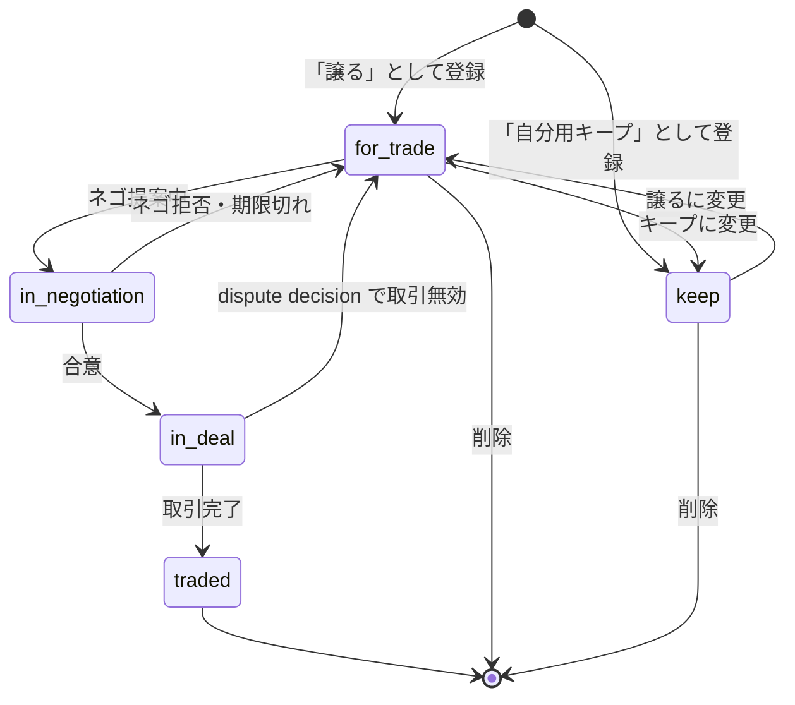
```mermaid
stateDiagram-v2
    [*] --> for_trade: 「譲る」として登録
    [*] --> keep: 「自分用キープ」として登録

    keep --> for_trade: 譲るに変更
    for_trade --> keep: キープに変更

    for_trade --> in_negotiation: ネゴ提案中
    in_negotiation --> for_trade: ネゴ拒否・期限切れ
    in_negotiation --> in_deal: 合意

    in_deal --> traded: 取引完了
    in_deal --> for_trade: dispute decision で取引無効

    traded --> [*]
    for_trade --> [*]: 削除
    keep --> [*]: 削除
```

### 状態定義

| 状態 ID | 表示名 | 意味 |
|---|---|---|
| `for_trade` | 譲る候補 | 公開中・打診対象 |
| `keep` | 自分用キープ | 譲らず保持 |
| `in_negotiation` | 提案中 | 1件以上のネゴで使用中 |
| `in_deal` | 取引中 | 合意済 deal で確保 |
| `traded` | 譲り済 | 過去ログ |

### ビジネスルール

- **複数提案OK**: 同じアイテムが複数のネゴで `in_negotiation` 同時可能
- **合意で確定**: `in_deal` になると他のネゴで自動的に「使用不可」表示
- **traded 表示**: B-1 の「過去に譲った」サブビューで参照（iter19.5）
- **数量管理**: アイテムは `qty` を持ち、提案ごとに `selectedQty` を割り当てる（iter29）
- **市場残数（iter153 → iter586）**: `for_trade` のマッチング対象数は、実在庫 `quantity` から `agreed` かつ未完了の打診で確保済みの `locked_qty` を差し引いた `market_available_qty` を使う。`market_available_qty <= 0` の譲候補は、ホーム、検索、打診作成、個別募集作成・編集の候補から除外する。
- **表示数量との分離（iter153）**: マイ在庫では実在庫 `quantity` を表示し続ける。ホーム、打診作成、個別募集作成・編集では市場残数を数量上限として使う。
- **履歴保持（iter582）**: 市場残数が 0 になったグッズはユーザー向け候補から消すが、取引履歴・証跡保持のため物理削除ではなく、論理削除・非表示・closed/archived 相当で扱う。
- **traded の不変性（iter154.18）**: 「過去に譲った」アイテムは取引履歴の整合性を保つため、B-1 ではタップ時に詳細表示のみ行う。更新・削除は UI とサーバーアクションの両方で拒否する。

### 関連画面

- B-1 在庫一覧
- B-2 撮影フロー
- C-0 提示物選択（譲側）

### 関連ファイル

- `Megrum/b-inventory.jsx`
- `Megrum/propose-select.jsx`

---

## 6. Wish Lifecycle

求めているグッズの管理。

### 状態図

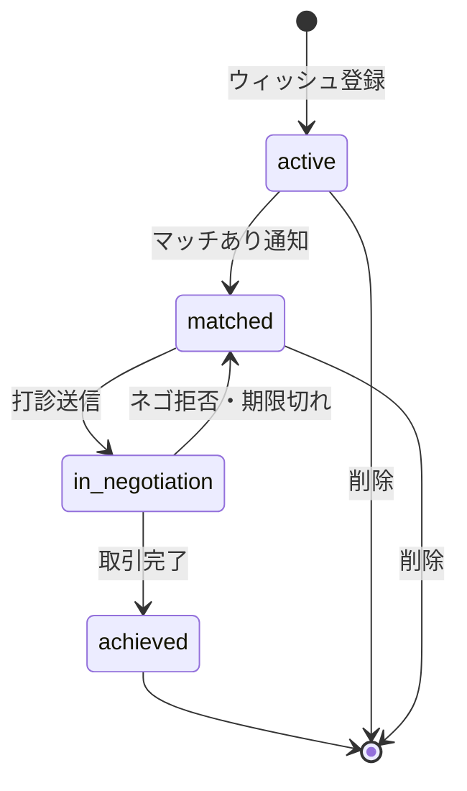
```mermaid
stateDiagram-v2
    [*] --> active: ウィッシュ登録
    active --> matched: マッチあり通知
    matched --> in_negotiation: 打診送信
    in_negotiation --> matched: ネゴ拒否・期限切れ
    in_negotiation --> achieved: 取引完了

    achieved --> [*]
    active --> [*]: 削除
    matched --> [*]: 削除
```

### 状態定義

| 状態 ID | 表示名 | 意味 |
|---|---|---|
| `active` | 探し中 | 検索対象 |
| `matched` | マッチあり | 候補あり通知済 |
| `in_negotiation` | 打診中 | ネゴ中 |
| `achieved` | 達成 | 取引完了で入手済 |

### ビジネスルール

- **L1 / L2 選択（iter582）**: L1 はグループ / 作品、L2 はメンバー / キャラクター。L2 マスターに値がある場合、Wish の L2 無指定は禁止する。L2 マスターに値がない場合だけ、L1 そのものを Wish 対象として選択できる。
- **コレクション表示**: wish ベースで影絵→入手済の図鑑（iter19.7-9）
- **コンプリート目標は否定**: 「全種コンプ」を強制しない設計（ユーザー判断）

### 関連画面

- ウィッシュタブ（hub-screens.jsx）
- コレクション図鑑（4画面）

### 関連ファイル

- `Megrum/hub-screens.jsx`

---

## 7. Account Lifecycle

ユーザーアカウントのライフサイクル。

### 状態図

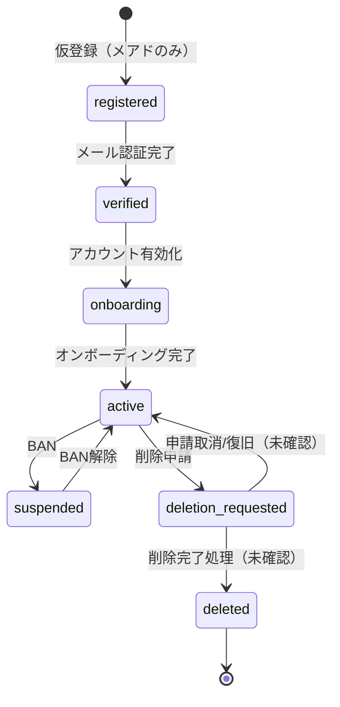
```mermaid
stateDiagram-v2
    [*] --> registered: 仮登録（メアドのみ）
    registered --> verified: メール認証完了
    verified --> onboarding: アカウント有効化
    onboarding --> active: オンボーディング完了

    active --> suspended: BAN
    suspended --> active: BAN解除

    active --> deletion_requested: 削除申請
    deletion_requested --> deleted: 削除完了処理（未確認）
    deletion_requested --> active: 申請取消/復旧（未確認）

    deleted --> [*]
```

### 状態定義

| 状態 ID | 表示名 | 意味 |
|---|---|---|
| `registered` | 仮登録 | メール認証前 |
| `verified` | 認証済 | メール認証完了 |
| `onboarding` | オンボ中 | Welcome→推し設定（グループ・作品→メンバー・キャラクター必要時）→活動エリア→名前→ユーザーID→生年月日→性別→完了 |
| `active` | アクティブ | 通常アカウント |
| `suspended` | 停止中 | BAN 状態 |
| `deletion_requested` | 削除申請中 | 削除予定日が設定された通常利用停止状態 |
| `deleted` | 削除済 | terminal |

### ビジネスルール

- **OAuth経路（Apple/Google等）**: メール認証 skip → `verified` に直行（iter20, iter343）
- **削除予定日（iter1221 / 2026-06-29再確認）**: 現行RPCは申請時刻から30日後の `deletion_scheduled_at` を保存する。ただし、2026-06-29時点のコード確認では、30日後に自動で `deleted` へ遷移するジョブ、ログインで `active` へ復帰する処理、`cancelled` / `completed` を更新するAPIは未確認。公開文面では、30日完了やログイン復旧を保証しない。
- **退会申請の制約（iter1221）**: `sent` / `negotiating` / `agreement_one_side` / `agreed` の進行中取引が1件でもある場合、`active -> deletion_requested` へ遷移できない。退会理由は `account_deletion_requests.reasons`、任意メモは `account_deletion_requests.note` に保存する。
- **オンボーディング段階**: iter1226.17以降、認証後は Welcome → 推し設定（グループ・作品選択 → メンバー・キャラクター選択が必要な場合のみ） → 活動エリア → 名前 → ユーザーID → 生年月日 → 性別 → 完了の8ステップで登録する。名前とユーザーIDの入力欄は初期値を空にし、既存の仮プロフィール値を事前入力しない。初回設定の性別候補は女性・男性のみ。状態IDは既存の `onboarding` / `active` を維持する。
- **生年月日・年齢表示（iter1226.110法務追記）**: 生年月日入力と算出年齢表示は自己申告プロフィール情報として扱う。2026-06-29時点のコード確認では、最低年齢ゲート、公的年齢確認、身分証確認、保護者同意確認、保護者管理状態を示す専用stateは未確認であり、公開文面・App Store回答では年齢確認済みと説明しない。
- **公開プロフィール・候補表示（iter1226.111法務追記）**: 性別、活動エリア、年齢、評価、完了取引数、支払い方法要約などの表示は、自己入力又は利用状況に基づく参考情報として扱う。本人確認済み、安全確認済み、法的性別確認済み、居住地確認済み、支払能力確認済み、運営推薦を示すstateは作らない。
- **評価・通報・ブロック・モデレーション（iter1226.112法務追記）**: 評価、通報、異議申し立て、ブロック、モデレーションstatusは安全対応、表示制御、問い合わせ対応、監査のための運用状態であり、本人確認済み、安全確認済み、信用確認済み、違反確定、無違反確定、緊急通報済み、法的判断済みを示すstateは作らない。
- **保存済みセッションからの復帰**: iter1226.86以降、保存済みセッションで再起動した `onboarding` はログイン画面へ戻さず、認証状態を維持してアカウント設定の続きへ進める。`registered` / `verified` は初回設定開始前の状態としてログイン画面へ戻す余地を残し、`active` 以降は通常画面を維持する。

### 関連画面

- Swift Native iOS 認証後オンボーディング

### 関連ファイル

- `ios-native/Sources/MegrumApp/AccountSetupScreen.swift`
- `ios-native/Sources/MegrumApp/AccountSetupFormViews.swift`
- `ios-native/Sources/MegrumApp/AccountSetupOshiSection.swift`
- `ios-native/Sources/MegrumApp/AccountSetupStepViews.swift`

---

## 8. Listing Lifecycle

個別募集（pinpoint listing / UI 表記は **「個別募集」**）。
譲 1 件と wish 1 件を紐付けて、比率・タグを設定するピンポイント募集。
iter64 で導入予定（notes/18 §B-2）。

### 状態図

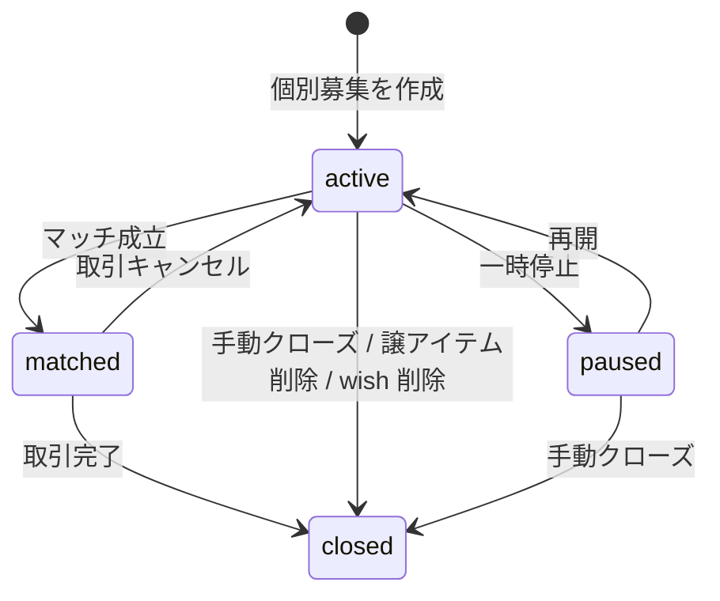
```mermaid
stateDiagram-v2
    [*] --> active: 個別募集を作成
    active --> paused: 一時停止
    paused --> active: 再開
    active --> matched: マッチ成立
    matched --> active: 取引キャンセル
    matched --> closed: 取引完了
    active --> closed: 手動クローズ / 譲アイテム削除 / wish 削除
    paused --> closed: 手動クローズ
```

### 状態定義

| 状態 | 説明 |
|---|---|
| `active` | 募集中（マッチング対象） |
| `paused` | 一時停止（マッチング対象外、UI には残る） |
| `matched` | 紐付く wish/譲が打診〜取引中 |
| `closed` | クローズ（譲削除・wish 削除・手動クローズ・取引完了） |

### 主要トリガー

- 関連 `goods_inventory` が `archived` / `traded` になったら自動 `closed`
- 関連 `goods_inventory` の譲アイテムが削除または非 active 化されたら、開いている個別募集の `have_ids` / `have_qtys` からそのアイテムを除外する。残る譲が 0 件なら `closed`。
- 関連 `user_wants` が `achieved` になったら自動 `closed`
- 取引完了（`deals.status = completed`）→ `closed`
- 取引キャンセル（cancelled）→ `active` に戻す

### ビジネスルール

- 1 個別募集 = 1 譲 × 1 wish（複数の wish を OR 対象にしたい場合は複数 listing を作る）
- 比率は `ratio_give` / `ratio_receive` ともに 1〜10
- 同じ (inventory_id, wish_id) ペアの個別募集は複数作成可能（異なる比率を試すため）
- **iter67.4 以降の実装差分**: 実装上は `have_ids[]` / `have_qtys[]` + `listing_wish_options` の「譲バンドル × 求複数選択肢」モデル。iter153 では、個別募集の譲数量も市場残数を上限にし、残数不足の条件はマッチング市場へ出さない。

---

## 9. Calendar Disclosure

打診時の「カレンダー公開」フラグのライフサイクル。iter65（Phase D）で導入。

### 状態図

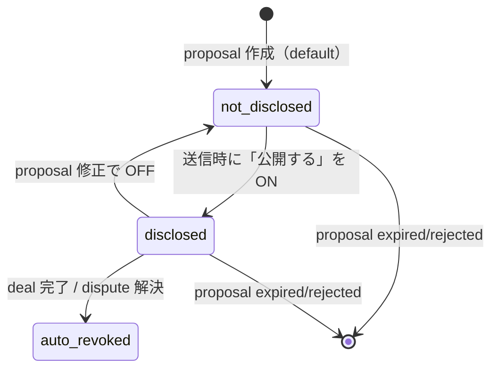
```mermaid
stateDiagram-v2
    [*] --> not_disclosed: proposal 作成（default）
    not_disclosed --> disclosed: 送信時に「公開する」を ON
    disclosed --> not_disclosed: proposal 修正で OFF
    disclosed --> auto_revoked: deal 完了 / dispute 解決
    not_disclosed --> [*]: proposal expired/rejected
    disclosed --> [*]: proposal expired/rejected
```

### 状態定義

| 状態 | 説明 |
|---|---|
| `not_disclosed` | `proposals.expose_calendar = false`（既定） |
| `disclosed` | `proposals.expose_calendar = true`、相手が overlay でスケジュールを見られる |
| `auto_revoked` | 取引完了時に自動的に閲覧不可。`expose_calendar` は履歴として `true` のまま、RLS で制御 |

### ビジネスルール

- `expose_calendar = true` のとき、相手は `schedules` を読める（RLS で許可）。AW はマッチング演算用で、重ね見の主対象にしない
- ただし、関連する `deals` のステータスが `completed` / `disputed_resolved` などの terminal になったら、RLS で閲覧を遮断する
- 閲覧側は **スケジュール重ね見 UI**（自分と相手の `schedules` を時系列で重ね描画）で候補時間を確認
- iter168.97 以降、スケジュールには任意の `place_name` を持たせ、重ね見画面や待ち合わせ候補登録時の背景表示に使う

---

## 11. Meguri Message Lifecycle

推しすれ違い機能のめぐりメッセージ状態管理。
iter157 で体験プロトタイプを iOS 版に追加し、iter162.41 でレター表記からLINE風のメッセージUIへ変更した。交換・打診・取引とは独立したソーシャル体験として扱う。

### 状態図

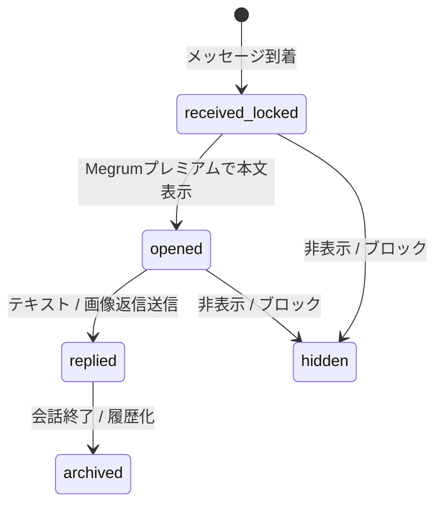
```mermaid
stateDiagram-v2
    [*] --> received_locked: メッセージ到着
    received_locked --> opened: Megrumプレミアムで本文表示
    opened --> replied: テキスト / 画像返信送信
    received_locked --> hidden: 非表示 / ブロック
    opened --> hidden: 非表示 / ブロック
    replied --> archived: 会話終了 / 履歴化
```

### 状態定義

| 状態 | 説明 |
|---|---|
| `received_locked` | 到着は見えるが本文は未表示。推し傾向・ぼかした場所/時刻・相性のみ表示 |
| `opened` | 月額プランで本文を表示済み。返信導線が有効 |
| `replied` | ユーザーが返信済み。以後は個別チャットとして扱う |
| `hidden` | ユーザーが非表示・ブロックした状態 |
| `archived` | 会話終了または履歴化した状態 |

### ビジネスルール

- 単発の本文表示チケットは作らず、現行のMegrumプレミアムで本文表示・返信を許可する。旧めぐりPlus / 旧Premium は互換権限として同じ判定に含める。
- 無料ユーザーは到着・未読数・モザイクプレビューまでは確認できるが、本文表示・テキスト返信・画像送信はできない。
- 実装上の有料判定は `user_entitlements(feature_key in ('megrum_plus','meguri_plus','premium'), active=true)` を参照する。無料ユーザーには `meguri_messages` の本文・画像パスを直接返さず、専用RPCでロック済みメタ情報だけ返す。
- Swift Nativeでは、ロック済み会話の一覧プレビューと各メッセージ本文を実テキストへblurをかけたモザイク表示にし、メッセージ本文側のモザイク上のボタンから「Megrumプレミアム」画面へ遷移する。
- Megrumプレミアムユーザーはテキスト返信に加えて画像メッセージを送信できる。画像は `meguri-message-media` private Storage pathとして保存し、`meguri_messages.message_type='image'` / `image_path` に紐づけ、閲覧可能な会話を取得した後だけ署名URLで表示する。
- 場所と時刻は必ず丸め、正確な地点・時刻・職場や生活導線の特定につながる表示は避ける。
- 交換・打診・取引とは独立し、`proposal` / `deal` 状態へ自動遷移しない。

---

## 12. Groom Lifecycle

めぐり機能の「グルーム」投稿状態管理。
iter162.49 で、インスタグラムのストーリーに近い一過性スナップとして追加。フォロー関係ではなく、めぐりあった人・同じ現場圏内という場所と時間の文脈で閲覧できる。

### 状態図

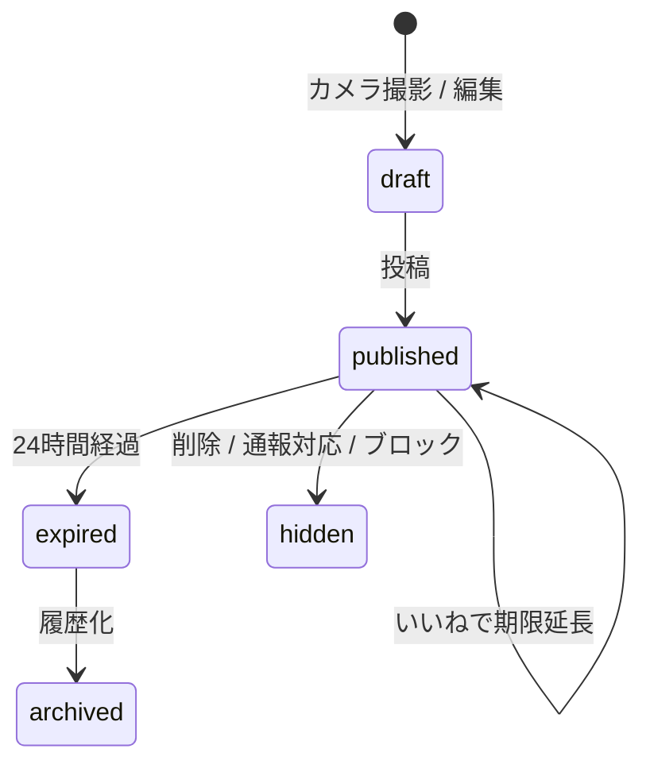
```mermaid
stateDiagram-v2
    [*] --> draft: カメラ撮影 / 編集
    draft --> published: 投稿
    published --> expired: 24時間経過
    published --> published: いいねで期限延長
    published --> hidden: 削除 / 通報対応 / ブロック
    expired --> archived: 履歴化
```

### 状態定義

| 状態 | 説明 |
|---|---|
| `draft` | 撮影後、投稿前に写真とひとことを確認している状態 |
| `published` | めぐりあった人に表示される状態。丸いアイコンと全画面ビューアで閲覧できる |
| `expired` | 24時間経過で通常閲覧できなくなった状態 |
| `hidden` | 投稿者削除、通報対応、ブロック関係により非表示になった状態 |
| `archived` | 履歴・分析用に保存された状態。通常ユーザーには表示しない |

### ビジネスルール

- ホーム一覧の表示対象は現在地から1km圏内の投稿に限定し、フォロー/フォロワー関係を前提にしない。
- グルームマップでは、位置情報を持つ投稿を丸アイコンとして地図上に表示する。1km圏内の投稿だけ内容を開け、1km圏外の投稿をタップした場合は「圏外のため見ることができません」と案内する。
- iter1225 以降、地図を広域表示した時は近接するグルームをクラスタ化し、Megrumアイコン入りの吹き出しと件数バッジで表示する。クラスタタップ時は含まれるグルームをまとめて閲覧する。これは表示集約であり、投稿状態は変えない。
- 投稿時に `origin_lat/origin_lng` を保存する。画面には正確な位置を出さず、`place_hint` の丸めた表示だけを使う。
- 場所と時刻は必ず丸め、正確な現在地・生活導線・滞在時刻を特定できる表示にしない。
- グルームへの返信は、めぐりメッセージ導線へつなげる。交換・打診・取引へは自動遷移しない。
- iter165 以降、`encountered_people` の閲覧は `audience_user_ids` に含まれるユーザーだけに制限する。空配列を公開フィード扱いにしない。
- `groom-posts` Storage は private bucket とし、`can_view_groom_post()` を満たす投稿だけ署名URLを発行する。
- 例外として、`groom_replies.groom_snapshot.image_path` に残した投稿画像は、投稿が期限切れ/アーカイブ済みでも返信スレッド参加者だけ署名URLを発行できる。
- `published` の通常表示は `expires_at > now()` の投稿だけに限定する。アプリ起動時/復帰時に `expire_groom_posts()` を呼び、pg_cron が利用できる環境では15分間隔でも期限切れ投稿を `expired`、期限切れから7日経過した投稿を `archived` へ進める。
- いいねは `groom_reactions`、閲覧済みは `groom_views`、返信は `groom_replies` に保存する。iter1226.14以降、新規いいねは `notifications.kind='groom_liked'`、返信は `notifications.kind='groom_reply'` をDB triggerで作り、返信通知のbodyには本文プレビューを入れない。めぐりメッセージで開いた時に `groom_replies.read_at` を更新する。
- iter1225 以降、いいねは `set_groom_like_for_viewer()` RPCで更新する。新規いいねが1件作成された場合だけ `expires_at` を3時間延長し、重複いいねや取り消しでは期限を延長/短縮しない。アプリは `like_count` を表示し、いいね済みはピンクのハートで示す。
- グルーム返信後の通常会話は `meguri_messages` に保存し、`notifications.kind='meguri_message'` をDB triggerで作る。グルーム返信から複製された起点メッセージは `groom_reply` 通知と重複させず、通常めぐりメッセージ通知のbodyにも本文プレビューを入れない。受信者が会話を開いた時に `meguri_messages.read_at` を更新する。
- ユーザー単位の非表示は `groom_hidden_posts`、ブロックは `groom_user_blocks`、通報は `groom_reports` に保存し、RLSとアプリフィードの両方で表示対象から除外する。
- グルームのブロックは `groom_user_blocks` に保存するめぐり文脈ブロックであり、グッズ交換のブロックとは別の扱いにする。
- iter1226.112 以降、`hidden` は表示抑制又はモデレーション状態であり、投稿削除、通報解決、補償、相手への処分、通報者秘匿、緊急通報、法的判断を意味しない。監査、法令対応、再発防止のため、投稿、返信、通報、ブロック関係、関連ログを保持する場合がある。
- 初期実装は写真1枚 + ひとこと + いいね + メッセージ入力を対象にし、動画・公開範囲の細分化は後続検討とする。

---

## 13. Meguri Board Lifecycle（チャットルーム）

旧「スポット掲示板」。めぐり内のスレッド型チャットルーム。交換成立そのものではなく、現地の情報共有・雑談・列状況・導線共有を扱う。

### 状態図

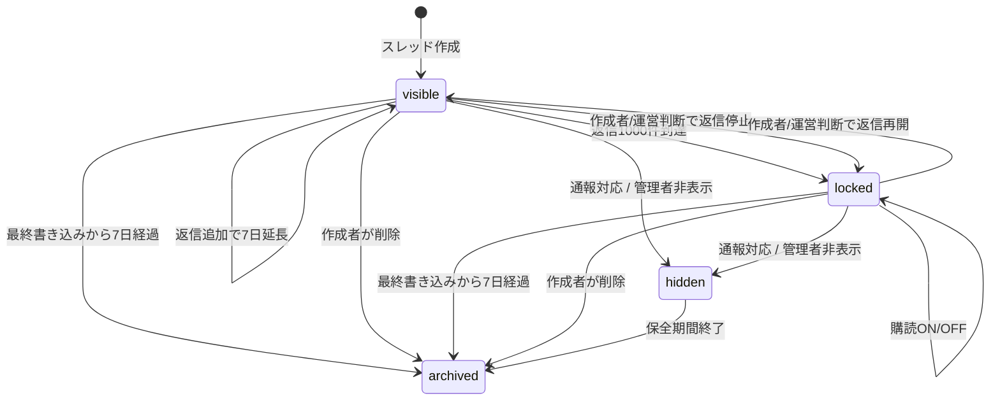
```mermaid
stateDiagram-v2
    [*] --> visible: スレッド作成
    visible --> visible: 返信追加
    visible --> visible: 購読ON/OFF
    visible --> visible: 返信追加で7日延長
    visible --> locked: 返信1000件到達
    visible --> locked: 作成者/運営判断で返信停止
    locked --> locked: 購読ON/OFF
    locked --> visible: 作成者/運営判断で返信再開
    visible --> archived: 最終書き込みから7日経過
    visible --> archived: 作成者が削除
    locked --> archived: 最終書き込みから7日経過
    locked --> archived: 作成者が削除
    visible --> hidden: 通報対応 / 管理者非表示
    locked --> hidden: 通報対応 / 管理者非表示
    hidden --> archived: 保全期間終了
```

### 状態定義

| 状態 | 説明 |
|---|---|
| `visible` | 公開範囲に入るユーザーが一覧・詳細で閲覧できる状態 |
| `locked` | 閲覧はできるが返信追加を止めた状態。作成者または運営が再開できる |
| `hidden` | 通報対応や管理者判断で通常表示から外した状態 |
| `archived` | 保全・分析用に残し、通常ユーザーには表示しない状態 |

### ビジネスルール

- 新規スレッドの公開範囲は `nearby_3km` / `same_prefecture` の2択。
- iter1225 以降、スレッドは最後の書き込みから1週間で通常表示から外れ、`expire_meguri_board_threads()` により `archived` へ進む。残り時間は一覧・詳細に表示する。
- iter1225 以降、返信数が1000件に到達したスレッドは `locked` になり、新規返信を受け付けない。iter1226.101 以降、ユーザーのスレッド作成は1日20件までDBトリガーで制限し、作成は `create_meguri_board_thread_for_viewer()` RPCで行う。
- iter1225 以降、スレッド作成時にチャットルームごとの匿名表示名と6種類の仮アバターを設定できる。未指定時は通常プロフィール表示へフォールバックする。
- `nearby_3km` は互換維持のraw値として残す。現在のめぐり画面ではスレッド作成時の `origin_lat/origin_lng` を基準に、無料ユーザーは閲覧者の現在地から1km以内なら詳細閲覧できる。`megrum_plus` / `meguri_plus` / `premium` の有効権限を持つユーザーは、チャットルームに限り1km圏外でも表示・詳細閲覧できる。
- `same_prefecture` はスレッド作成時の都道府県を基準に、閲覧者がチャットルームで選んだ都道府県と一致する場合に表示する。
- チャットルームの都道府県は初回のみプロフィールの都道府県を既定値にし、ユーザーが画面内で変更した後は端末保存値を次回以降の既定値にする。
- めぐりホームとチャットルームマップでは位置情報を持つスレッドを地図上に表示する。無料ユーザーは1km圏内のスレッドだけ詳細へ進め、1km圏外のスレッドをタップした場合は「圏外のため見ることができません」と案内する。有料権限を持つユーザーはチャットルームの1km圏外表示・詳細閲覧が可能。グルームは有料権限に関係なく1km圏内だけ通常閲覧できる。
- iter1225 以降、めぐり地図は `すべて` / `グルームのみ` / `チャットルームのみ` を切り替えられる。初期表示でチャットルームボトムシートは開かず、チャットルームピンをタップした時だけ該当スレッドを開く。
- iter1226.12 以降、めぐりホーム自体に `すべて` / `グルーム` / `チャット` の表示切替を置き、ホーム地図の1km圏内をタップして `グルーム` または `チャット` 作成を選べる。地図タップで作成地点が確定している場合、作成画面内の最終位置決めステップはスキップする。
- iter191 以降、`is_pinned=true` のスレッドは一覧・詳細で固定バッジを表示し、通常の並び替えより上位に置く。
- iter172 以降、自分のスレッドはタイトル/本文/カテゴリを編集でき、締め切り/再開/削除ができる。削除は `archived` へのソフト削除。
- iter172 以降、自分の返信は編集でき、削除時は `meguri_board_replies.status='deleted'` としてプレースホルダ表示にする。
- iter173 以降、返信は他の返信を引用できる。引用は `parent_reply_id` と表示用スナップショットを保存し、引用元が編集・削除されても会話の文脈を保つ。
- iter173 以降、スレッド詳細内で返信本文・引用本文・返信者名を対象に検索できる。検索は表示絞り込みで、スレッド状態は変えない。
- iter185 以降、削除されていない返信はiOS共有シートへ渡せる。共有は表示操作であり、スレッド/返信の状態は変えない。
- iter183 以降、掲示板一覧とスレッド詳細はプル更新で最新状態を再取得できる。更新中も既存表示は維持し、取得後に一覧/返信を差し替える。
- iter189 以降、スレッド詳細では返信が1件以上ある場合に最新返信へ移動できる。これは表示操作であり、スレッド/返信の状態は変えない。
- iter190 以降、スレッド詳細では既読更新前の `read_at` より新しい最初の返信の上に未読区切りを表示する。スレッド内検索中は未読区切りを表示しない。
- iter192 以降、スレッド詳細ではスレッド作成者と可視返信者から参加者一覧を表示できる。参加者一覧は表示操作であり、スレッド/返信の状態は変えない。
- iter193 以降、参加者一覧で可視返信がある参加者を選ぶと、その参加者名または handle でスレッド内返信を絞り込む。これは検索条件の変更であり、スレッド/返信の状態は変えない。
- iter194 以降、スレッド詳細では返信ごとに元スレッド内の通し番号を表示し、スレッド作成者の返信には作成者バッジを表示する。検索で絞り込んでも通し番号は変えない。
- iter195 以降、引用返信の引用プレビューを選ぶと引用元の返信へ移動する。スレッド内検索中は検索条件を解除してから移動し、スレッド/返信の状態は変えない。
- iter196 以降、スレッド内検索では返信番号（例: `#12`）も検索対象に含める。検索中の件数表示は検索結果/全件数の形式にする。
- iter197 以降、スレッド内検索中は返信本文、引用本文、引用者名、返信者名、返信番号の一致箇所を強調表示する。強調表示は表示操作であり、スレッド/返信の状態は変えない。
- iter198 以降、スレッド内検索中は検索結果の現在位置/総件数を表示し、前後の検索結果へ移動できる。検索結果ナビは表示操作であり、スレッド/返信の状態は変えない。
- iter174 以降、スレッド作成者と返信者は `meguri_board_thread_subscriptions.notification_enabled=true` で自動購読される。ユーザーは一覧/詳細からスレッド単位の通知ON/OFFを切り替えられる。iter1226.14以降、スレッドに「参考になった」を付けたユーザーも自動購読される。
- iter174 以降、購読中スレッドに自分以外が返信すると `notifications.kind='meguri_board_reply'` を作成し、通知タップで該当スレッドへ戻れるようにする。通知OFFのユーザーと返信者本人には送らない。iter1226.14以降、チャットルーム通知のbodyには返信本文プレビューを入れない。
- iter175 以降、返信本文の `@handle` は掲示板メンションとして解釈する。本人以外かつ対象スレッドを閲覧できるユーザーには `notifications.kind='meguri_board_mention'` を作成し、通常の購読返信通知とは重複させない。設定一覧のチャットルーム通知OFFはOSプッシュだけを止め、アプリ内通知行は残す。
- iter184 以降、返信アクションから「メンションして返信」を選ぶと返信入力欄へ対象ユーザーの `@handle` を挿入する。削除済み返信、自分の返信、`locked` スレッドでは挿入しない。
- iter176 以降、スレッドと返信は最大4枚の画像を添付できる。画像は `meguri-board-media` private Storage path として保存し、閲覧可能なスレッド/返信を取得した後だけ署名URLで表示する。
- iter182 以降、スレッド詳細内の添付画像はタップで全画面プレビュー表示できる。これは表示状態のみで、スレッド/返信の状態は変えない。
- iter199 以降、スレッド詳細ではスレッド本文と可視返信の添付画像を画像一覧として集約表示できる。画像一覧から画像プレビューを開け、投稿元の本文または返信位置へ移動できる。
- iter200 以降、スレッド詳細の返信一覧は `oldest`（古い順）/ `newest`（新着順）/ `popular`（参考順）で表示順を切り替えられる。返信番号は元スレッド内の通し番号を維持し、未読区切りは `oldest` の時だけ表示する。
- iter201 以降、スレッド詳細では返信番号を入力して該当返信へ直接移動できる。移動基準は表示順ではなく元スレッド内の返信番号で、検索条件が入っている場合は解除してから移動する。
- iter202 以降、引用返信の引用プレビューと返信入力中の引用バーには引用元の返信番号を表示する。引用元番号はスレッド内検索対象にも含める。
- iter203 以降、スレッドと返信のアクションシートから投稿者プロフィールへ移動できる。自分の投稿の場合は自分のプロフィールタブへ、相手の投稿の場合は相手プロフィールへ遷移する。
- iter204 以降、掲示板一覧のスレッドアクションシートからも投稿者プロフィールへ移動できる。カード本体のタップはスレッド詳細遷移を維持する。
- iter205 以降、掲示板一覧では検索・カテゴリ・並び替えを反映した表示件数を表示する。検索語、カテゴリ、並び替えのいずれかが既定値から変わっている場合は条件リセットを表示する。
- iter206 以降、参加者一覧では参加者行タップで返信フィルタ、`プロフィール` ボタンで投稿者プロフィールへ移動する。自分の場合は自分のプロフィールタブへ遷移する。
- iter207 以降、掲示板一覧では添付画像があるスレッドに画像枚数バッジを表示する。これは表示操作であり、スレッド/返信の状態は変えない。
- iter208 以降、掲示板一覧では画像付きスレッドだけを表示する `画像あり` フィルタを使える。検索・カテゴリ・並び替えと併用でき、条件リセットで解除する。
- iter209 以降、掲示板一覧のスレッドカード長押しでも、共有・プロフィール・保存・通知・非表示・通報などの既存アクションシートを開ける。通常タップは詳細遷移を維持する。
- iter210 以降、スレッド詳細では長い本文を初期表示で折りたたみ、`続きを読む` / `閉じる` で展開できる。これは表示状態のみで、スレッド状態は変えない。
- iter211 以降、スレッド詳細では返信行の長押しでも、引用・共有・プロフィール・編集/削除・通報などの既存返信アクションシートを開ける。
- iter212 以降、スレッド詳細で返信検索中または参加者別返信フィルタ中は、検索欄の下に現在の条件チップを表示し、`解除` で検索条件をクリアできる。
- iter213 以降、スレッド詳細の返信欄では本文または添付画像がある時に下書き保存中表示を出し、`破棄` で端末内下書き・引用対象・入力内容を削除できる。
- iter214 以降、掲示板一覧のスレッド作成モーダルではタイトル/本文/添付画像がある時に下書き保存中表示を出し、`破棄` で端末内下書き・入力内容を削除できる。
- iter215 以降、スレッド作成のタイトル/本文とスレッド詳細の返信入力では文字数カウンターを表示し、UI表示と入力上限を一致させる。
- iter216 以降、掲示板一覧では未読スレッドに `未読` バッジとカード強調を表示し、既読化後は通常表示へ戻す。
- iter217 以降、掲示板一覧で検索/カテゴリ/並び替え/画像ありの条件が有効な時は条件チップを表示し、チップ操作で該当条件だけ解除できる。
- iter218 以降、スレッド詳細ヘッダーの返信ボタンで返信入力欄へフォーカスできる。`locked` スレッドでは返信ボタンを表示しない。
- iter219 以降、スレッド詳細では返信本文に自分の `@handle` が含まれる他ユーザー返信に `あなた宛て` バッジとバブル強調を表示する。
- iter220 以降、スレッド詳細で未読返信がある場合は返信ヘッダーに `未読へ` を表示し、未読区切り位置へ移動できる。表示順が `oldest` 以外の場合は `oldest` に戻してから移動する。
- iter221 以降、スレッド詳細で自分宛てメンション返信がある場合は返信ヘッダーに `あなた宛て n` を表示し、`@handle` 検索で該当返信だけを絞り込める。
- iter222 以降、スレッド詳細で自分の返信がある場合は返信ヘッダーに `自分 n` を表示し、自分が投稿した返信だけを絞り込める。
- iter223 以降、掲示板一覧では保存/通知/参加中/自分/未読の対象がある時だけ、各フィルタボタンに件数バッジを表示する。
- iter224 以降、掲示板一覧では返信下書きが残っているスレッドを `下書き` で絞り込める。該当スレッドカードには `下書きあり` を表示する。
- iter225 以降、スレッド詳細では返信に子返信がある場合、返信アクション行に `返信 n` を表示し、その返信に紐づく返信だけを絞り込める。
- iter226 以降、スレッド詳細の本文と返信本文では `https://` / `http://` URLを自動リンク化し、タップで外部ブラウザ/対応アプリを開ける。これは表示操作であり、スレッド/返信の状態は変えない。
- iter227 以降、返信アクションシートから対象返信の投稿者による返信だけを絞り込める。これは参加者別フィルタのショートカットであり、スレッド/返信の状態は変えない。
- iter228 以降、スレッド詳細では `情報` から公開範囲、場所、作成/更新日時、参加者数、画像数、参考数、保存数、閲覧数、状態をまとめて確認できる。これは表示操作であり、スレッド/返信の状態は変えない。
- iter229 以降、返信共有リンクに `replyId` が含まれる場合、スレッド詳細の読み込み後に対象返信へ自動スクロールする。これは表示操作であり、スレッド/返信の状態は変えない。
- iter230 以降、返信共有リンク、引用元、返信番号、検索結果から返信へ移動した時は対象返信を短時間ハイライトする。これは表示操作であり、スレッド/返信の状態は変えない。
- iter231 以降、スレッド内検索/返信フィルタ中または表示順変更中の返信は、条件を解除して `oldest` 表示の元スレッド全体の流れへ戻して表示できる。これは表示操作であり、スレッド/返信の状態は変えない。
- iter232 以降、長い返信本文は検索中を除き初期表示で折りたたみ、ユーザー操作で全文表示/折りたたみを切り替えられる。これは表示操作であり、スレッド/返信の状態は変えない。
- iter233 以降、引用プレビューから引用元返信へ移動した場合、移動元の返信へ戻る導線を返信ヘッダーに表示できる。これは表示操作であり、スレッド/返信の状態は変えない。
- iter234 以降、参加者一覧モーダルでは参加者名、handle、エリア、自分/作成者ラベルを対象に参加者を検索できる。これは表示操作であり、スレッド/返信の状態は変えない。
- iter235 以降、参加者一覧モーダルでは参加者を最近の活動順または返信数順で並び替えられる。これは表示操作であり、スレッド/返信の状態は変えない。
- iter236 以降、返信はユーザー単位で保存でき、保存済み返信だけをスレッド内で絞り込める。MVPでは端末内状態として保持し、削除済み返信は保存済み表示から外す。
- iter237 以降、返信入力中に末尾で `@` を入力するとスレッド参加者候補を表示し、選択すると `@handle` または `@名前` を返信本文へ挿入できる。これは入力補助であり、投稿まで通知や返信状態は変えない。
- iter238 以降、スレッド詳細では画像付き返信がある場合に `画像 n` を表示し、画像付き返信だけを絞り込める。これは表示操作であり、スレッド/返信の状態は変えない。
- iter239 以降、スレッド詳細ではスレッド作成者の可視返信がある場合に `作成者 n` を表示し、作成者の返信だけを絞り込める。これは表示操作であり、スレッド/返信の状態は変えない。
- iter240 以降、スレッド詳細では各返信のアクション列に `返信する` を表示し、既存の引用返信入力へ直接入れる。削除済み返信と `locked` スレッドでは無効化する。
- iter241 以降、返信入力欄で引用対象がある時は引用バー本文をタップして元返信へ移動できる。引用解除は `×` でのみ行い、移動操作では引用対象を保持する。
- iter242 以降、スレッド詳細をプル更新して新しい可視返信が増えた場合は `新着 n` を表示し、最初の新着返信へ移動できる。初回読み込みや通常フォーカス更新では新着表示を出さない。
- iter243 以降、スレッド詳細では各返信のアクション列に `保存` / `保存済み` を常時表示し、返信単位の保存/解除を直接操作できる。削除済み返信では無効化する。
- iter244 以降、スレッド詳細では返信の相対時刻をタップすると投稿日時を詳細表示できる。編集済み返信では編集日時も表示する。これは表示操作であり、スレッド/返信の状態は変えない。
- iter245 以降、他ユーザー返信のアイコンまたは名前をタップすると返信者プロフィールへ遷移できる。これは閲覧導線であり、スレッド/返信の状態は変えない。
- iter246 以降、親返信を持つ返信ではアクションシートから `引用元を見る` を選び、引用元返信へ移動できる。これは表示操作であり、スレッド/返信の状態は変えない。
- iter247 以降、スレッド本文カードの投稿者名をタップすると投稿者プロフィールへ遷移できる。これは閲覧導線であり、スレッド/返信の状態は変えない。
- iter248 以降、掲示板一覧のスレッドカードでも投稿者名をタップすると投稿者プロフィールへ遷移できる。カード全体のスレッド遷移とは別の閲覧導線であり、スレッド/返信の状態は変えない。
- iter249 以降、掲示板一覧のスレッドカード右上には `作成` / `更新` / `返信` の種別つき相対時刻を表示する。これは表示ルールであり、スレッド/返信の状態は変えない。
- iter250 以降、掲示板一覧の並び替え/表示モードは横スクロール可能なチップ列として表示する。これは表示ルールであり、スレッド/返信の状態は変えない。
- iter251 以降、掲示板一覧のスレッドカードでは `thread.participated=true` の時に `参加中` ラベルを表示する。これは表示ルールであり、スレッド/返信の状態は変えない。
- iter252 以降、掲示板一覧で返信下書きがあるスレッドカードには `下書きから返信する` 導線を表示する。押下時はスレッド詳細へ遷移し、返信下書き復元後に返信入力欄へフォーカスする。これは下書き再開導線であり、スレッド/返信の状態は変えない。
- iter253 以降、掲示板一覧のスレッドカードには `共有` ボタンを表示し、既存のスレッド共有シートを直接開ける。カード本体の詳細遷移とは独立した操作であり、スレッド/返信の状態は変えない。
- iter254 以降、掲示板一覧のスレッドカードでは `thread.bookmarked=true` の時に `保存済み`、`thread.subscribed=true` の時に `通知ON` ラベルを表示する。これは表示ルールであり、保存/通知状態そのものは既存の操作でのみ変わる。
- iter255 以降、掲示板一覧の未読スレッドはアクションシートから `既読にする` を実行できる。押下時は `read_at` を `latest_activity_at` 以上に更新し、未読表示から外れる。
- iter256 以降、掲示板一覧ヘッダーの更新ボタンから現在の表示条件を保ったままスレッド一覧を再取得できる。初期読み込み中または更新中は二重実行を避けるため無効化する。
- iter257 以降、スレッド詳細ヘッダーの更新ボタンから、現在のスレッド本文・返信一覧・既読状態を再取得できる。初期読み込み中または更新中は二重実行を避けるため無効化する。
- iter258 以降、`reported=true` のスレッド/返信には一覧・本文・返信行で `通報済み` ラベルを表示する。これは通報済み状態の表示であり、通報状態そのものは既存の通報操作でのみ変わる。
- iter259 以降、スレッド詳細の各返信行には `共有` ボタンを表示し、返信ID付き共有URLをiOS標準共有シートへ渡せる。削除済み返信では共有操作を無効化する。
- iter260 以降、スレッド詳細の本文カードアクション列には `共有` ボタンを表示し、スレッド全体の共有シートを直接開ける。これは共有導線であり、スレッド/返信の状態は変えない。
- iter261 以降、スレッド本文カード右上の相対時刻をタップすると、作成日時と更新日時を正確に確認できる。これは表示操作であり、スレッド/返信の状態は変えない。
- iter262 以降、他人のスレッド本文カードアクション列には `通報` ボタンを表示し、既存の通報理由選択へ直接入れる。通報済みの場合は `通報済み` と表示して無効化する。
- iter263 以降、他人のスレッド本文カードアクション列には `ブロック` ボタンを表示し、既存の確認アラートを経て投稿者ブロックへ進める。
- iter178 以降、ユーザーをブロックすると `groom_user_blocks` に保存し、相互にスポット掲示板のスレッド/返信を表示しない。ブロック関係にある相手のスレッドには返信できず、その相手からの掲示板返信通知・メンション通知も作成しない。
- iter1226.112 以降、掲示板の `hidden`、`reported=true`、ブロック関係は表示制御/運営処理の状態であり、違反確定、無違反確定、削除保証、通報者秘匿、緊急通報、法的判断を意味しない。ブロックしても過去の取引、取引チャット、証跡、評価、通報、異議申し立て、監査記録は当然には削除しない。
- iter171 以降、スレッドにはカテゴリ（質問/情報/雑談/交換/落とし物）、検索、並び替え（更新/新着/人気/保存）、保存、参考になった、既読、ユーザー単位の非表示、通報を持たせる。
- iter181 以降、掲示板一覧では `自分` 表示を選ぶと `thread.mine=true` のスレッドだけを表示する。検索・カテゴリ絞り込みとは同時に適用する。
- iter188 以降、掲示板一覧では `参加中` 表示を選ぶと `viewer_participated=true` のスレッドだけを表示する。参加中はスレッド作成者、または可視返信を書いたユーザーで、通知購読とは別に扱う。
- iter186 以降、掲示板一覧では `未読` 表示を選ぶと `read_at` がない、または `read_at < latest_activity_at` のスレッドだけを表示する。
- iter187 以降、`未読` 表示では表示中の未読スレッドを一括で既読扱いにできる。既読化はユーザー単位で `meguri_board_thread_reads.read_at` を更新し、スレッド本文・返信状態は変えない。
- スレッド詳細を開いたら `meguri_board_thread_reads.read_at` を更新し、一覧では `read_at < latest_activity_at` を未読として扱う。
- 保存・参考になった・非表示・通報はユーザー単位で保存する。非表示にしたスレッドは本人の一覧から除外する。
- iter179 以降、通報は即送信ではなく理由選択を挟む。理由は `spam` / `harassment` / `privacy` / `unsafe` / `off_topic` / `other` のいずれかを `meguri_board_reports.reason` に保存する。
- iter180 以降、スレッド作成中・返信中の内容は端末内下書きとして自動保存する。投稿/返信成功時は該当下書きを削除し、空の下書きは保持しない。
- スレッドは打診・取引チャットへ自動遷移しない。必要ならユーザープロフィールやグッズ交換導線から別フローで開始する。
- 正確な緯度経度は画面に表示しない。表示上は「1km圏内」「都道府県」などの丸めた文言だけを使う。

---

## 14. Admin / Billing Lifecycle（管理者・有料権限）

iter166 で、管理者ページ・管理者権限・Premium等の有料権限を実装するための状態を追加した。
管理者の操作は必ず `admin_audit_logs` に記録し、ユーザー側の有料機能判定は `subscriptions` の生状態ではなく `user_entitlements` の集約結果を見る。

### AdminRole 状態図

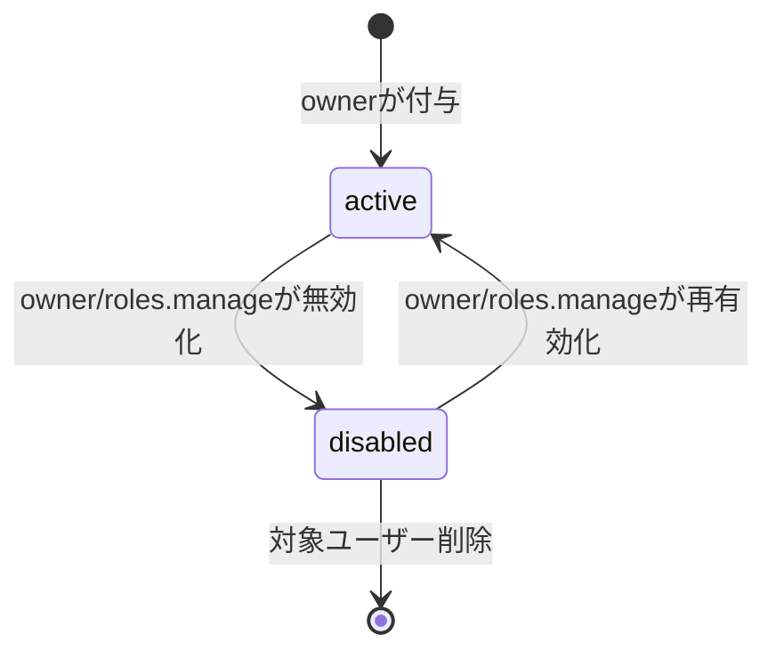
```mermaid
stateDiagram-v2
    [*] --> active: ownerが付与
    active --> disabled: owner/roles.manageが無効化
    disabled --> active: owner/roles.manageが再有効化
    disabled --> [*]: 対象ユーザー削除
```

| 状態 | 説明 |
|---|---|
| `active` | 管理者ページへアクセス可能。`requires_mfa=true` の場合は AAL2 セッション必須 |
| `disabled` | 管理者権限は保持されるがアクセス不可。履歴確認用に行は残す |

### Subscription / Entitlement 状態図

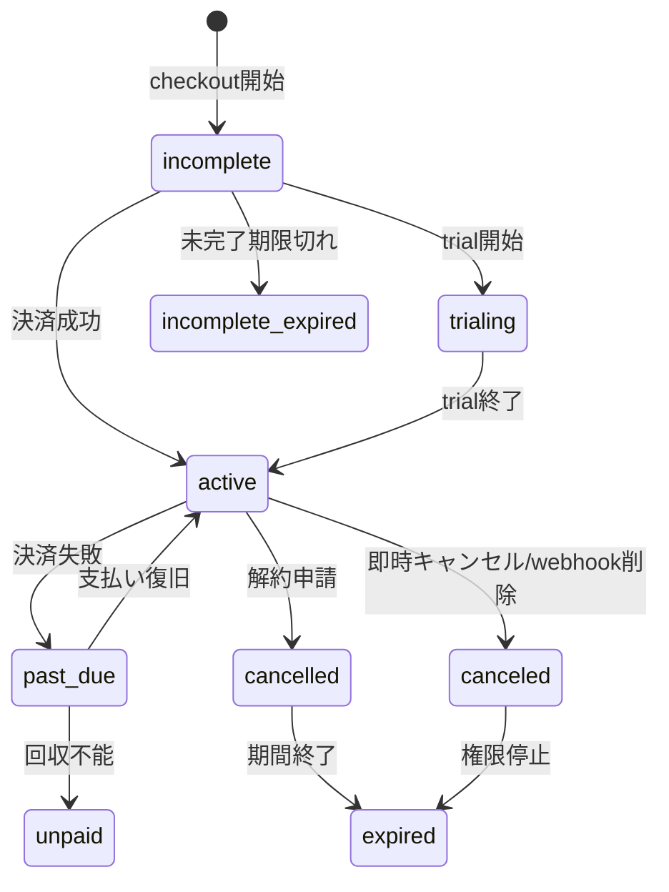
```mermaid
stateDiagram-v2
    [*] --> incomplete: checkout開始
    incomplete --> active: 決済成功
    incomplete --> trialing: trial開始
    incomplete --> incomplete_expired: 未完了期限切れ
    trialing --> active: trial終了
    active --> past_due: 決済失敗
    past_due --> active: 支払い復旧
    past_due --> unpaid: 回収不能
    active --> cancelled: 解約申請
    cancelled --> expired: 期間終了
    active --> canceled: 即時キャンセル/webhook削除
    canceled --> expired: 権限停止
```

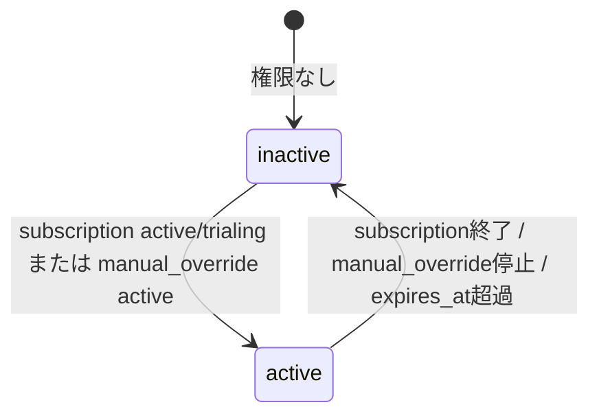
```mermaid
stateDiagram-v2
    [*] --> inactive: 権限なし
    inactive --> active: subscription active/trialing または manual_override active
    active --> inactive: subscription終了 / manual_override停止 / expires_at超過
```

| エンティティ | 状態 | 説明 |
|---|---|---|
| `subscriptions` | `incomplete` / `incomplete_expired` / `trialing` / `active` / `past_due` / `cancelled` / `canceled` / `unpaid` / `expired` | Stripe等プロバイダー由来の契約状態 |
| `user_entitlements` | `active=true/false` | アプリが参照する最終的な機能権限。`feature_key='megrum_plus'` が現行Megrumプレミアム判定、`premium` / `meguri_plus` は旧設計互換の判定 |
| `stripe_webhook_events` | `processing` / `processed` / `failed` / `ignored` | webhook処理の冪等性・再処理判断 |

### ビジネスルール

- 管理者の追加・更新は `roles.manage` 権限が必要。最後の `owner` を無効化・降格してはいけない。
- `requires_mfa=true` の管理者は Supabase Auth の AAL2 セッションでのみ管理者ページへ入れる。
- ユーザー停止・権限変更・有料権限手動上書きは、理由入力を必須にし `admin_audit_logs` に保存する。
- Stripe webhook は `stripe_webhook_events.event_id` で重複処理を防ぎ、`subscriptions` 更新後に plan_type に応じて `user_entitlements(feature_key='megrum_plus' | 'premium' | 'meguri_plus')` を upsert する。
- StoreKitで検証済みの `megrum.plus.monthly` は `sync_megrum_plus_purchase_for_viewer()` で `subscriptions.plan_type='megrum_plus_monthly'` と `user_entitlements(feature_key='megrum_plus')` へ同期する。App Store Server APIでのサーバー側署名検証は本番前タスク。
- 個別募集は無料プランでは `active` / `paused` / `matched` の合計3件まで。`megrum_plus` が有効ならDBトリガー・クライアントUIともに上限を外す。
- グルームアーカイブは無料プランでは最新10件まで。`megrum_plus` が有効ならビジネス上の保存上限を外し、アプリはページサイズ単位で取得する。
- めぐり掲示板は無料プランでは県内または現在地1km圏内の閲覧を基本にし、`megrum_plus` / 旧 `premium` / 旧 `meguri_plus` が有効なら県外掲示板も閲覧できる。
- 手動上書きは `plan_overrides` に履歴を残し、同時に `user_entitlements` を更新する。

## 15. 付録：エンティティ間の関係

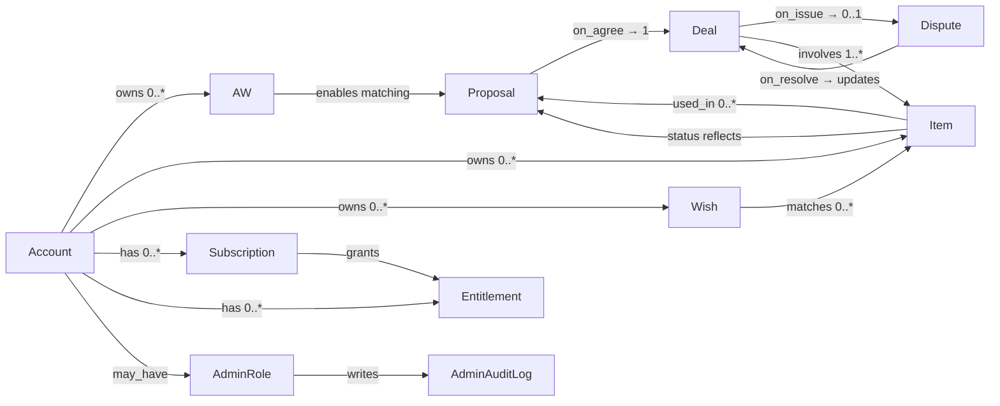
```mermaid
graph LR
    Account -->|owns 0..*| AW
    Account -->|owns 0..*| Item
    Account -->|owns 0..*| Wish
    Account -->|has 0..*| Subscription
    Account -->|has 0..*| Entitlement
    Account -->|may_have| AdminRole
    AW -->|enables matching| Proposal
    Item -->|used_in 0..*| Proposal
    Wish -->|matches 0..*| Item
    Proposal -->|on_agree → 1| Deal
    Deal -->|on_issue → 0..1| Dispute
    Dispute -->|on_resolve → updates| Deal
    Deal -->|involves 1..*| Item
    Item -->|status reflects| Proposal
    Subscription -->|grants| Entitlement
    AdminRole -->|writes| AdminAuditLog
```

### 関係性メモ

- **1 Proposal = 1 Deal**: 合意成立時点で Proposal は確定、以降は Deal のライフサイクル
- **1 Deal = 0..1 Dispute**: 1つの取引につき申告は最大1件（重複申告は不可）
- **1 Item は複数 Proposal で `in_negotiation`** だが、`in_deal` になれるのは1つだけ
- **1 Account は複数 AW を持てる**（過去・未来含めて）

---

## 未確定・要確認項目

実装着手前にユーザーと擦り合わせる項目。`05_data_model.md` の末尾「⚠️ 未確定項目」とも連携。

### ✅ iter39 で確定済

| # | 項目 | 確定内容 |
|---|---|---|
| 9 | Item の `kind=keep` は `status=in_negotiation` に遷移しうるか？ | **確定：完全分離・ならない**。譲りたくなったら `kind` を `for_trade` に変更してから |
| 12 | 到着検知の仕組み | **確定：MVPは手動のみ**。QR/GPSはPost-MVP |
| 15 | `meetup_scheduled_custom` を JSONB か別テーブルか | **確定：JSONB（MVP段階）**。将来切り出し可能 |
| 16 | `outfit_photo` を messages か専用テーブルか | **確定：両方**。専用テーブルで最新管理＋messagesにシステムメッセージで足跡 |
| - | `disputes.resolution.decision` 値リスト | **確定：5値（sender_fault/receiver_fault/mutual_fault/no_fault/cant_determine）+ penalty 4段階** |

### 状態遷移ルール関連（残）

| # | 項目 | 状況 |
|---|---|---|
| 1 | ネゴ中の提案修正で 7日カウントはリセットされるか？ | **要確認**（現状は継続前提で記述） |
| 2 | AW の `ended` から `archived` への自動遷移時間（24h？） | **要確認** |
| 3 | dispute の反論機会期間が 24h or 4h はカテゴリで変わるか？ | **要確認** |
| 4 | アカウント削除30日猶予の起点は申請時刻 or 日付ベース？ | **要確認** |
| 5 | Wish の `matched` 状態は1回通知するだけか、継続的に？ | **要確認** |
| 6 | Proposal の `cancelled` 状態を追加するか（送信前取消・送信後 sender 取消等）？ | **要確認** |
| 7 | `agreement_one_side` 中の提案修正で `agreed_by_*` を reset するか？ | **要確認** |
| 8 | `disputed` 解決時に `rated` に戻るか別の終了状態か？ | **要確認** |
| 10 | Item の `traded` 後に `kind` を保持か reset か？ | **要確認** |
| 11 | `auto_from_proposal` で作られた AW は、対応する deal が cancel/dispute になった時に削除？保持？ | **要確認** |

### 検知・トリガー関連（残）

| # | 項目 | 状況 |
|---|---|---|
| 13 | マッチング計算のバッチ頻度（毎日 / 6h / 1h） | **要確認** |
| 14 | リアルタイム通知のスロットル（同じユーザー間で1日N回まで等） | **要確認** |

### データ構造関連（残）

| # | 項目 | 状況 |
|---|---|---|
| 17 | `proposal_revisions` の履歴保存粒度（毎修正全部 vs 直近N件） | **要確認** |
| 18 | system message の `event_type` 値リスト確定（'arrival', 'agreement_one_side', 'outfit_shared' 等） | **要確認** |
| 19 | 郵送交換を Deal の別状態（`shipped` / `received` 等）として切るか、既存状態で扱うか | **要確認** |
| 20 | 郵送交換で、受信者の住所登録を `agreed` 前のどの時点で必須化するか | **要確認** |

これらは実装着手前にユーザーと擦り合わせる項目。詳細は `05_data_model.md` の「⚠️ 未確定項目」表を参照。
