# 09. 状態遷移図（State Machines）

> **目的**：Megrum の主要エンティティのライフサイクルと状態遷移ルールを定義。
> 実装が状態遷移でブレないための一次資料。デザイン・実装・QA の共通言語。

最終更新: 2026-05-30
ステータス: Draft v1.16（iter186 掲示板未読表示を追記）

---

## このドキュメントの使い方

- **記法**: mermaid（GitHub / VS Code / Mermaid Live でレンダリング可）
- **状態識別子**: `snake_case`（実装でも同じ識別子を使う）
- **トリガー**: `from → to` の遷移を起こすユーザー操作 or システムイベント
- **ビジネスルール**: 状態遷移に紐づく時間・SLA・前提条件

## 更新ルール

1. デザイン or 仕様変更で**状態の追加・削除・名称変更**があった場合、必ず該当箇所を更新する
2. 状態識別子は実装と完全一致させる（`agreed` を `agreement_complete` に勝手に変えない）
3. mermaid記法のエラーが出たら、Mermaid Live ([https://mermaid.live](https://mermaid.live)) で確認
4. 各セクション末尾の「関連画面」と「関連ファイル」を必ず併記し、cross-reference を保つ

## 目次

1. [Proposal Lifecycle（打診〜合意）](#1-proposal-lifecycle)
2. [Deal Lifecycle（合意〜完了）](#2-deal-lifecycle)
3. [Dispute Lifecycle（異議申し立て）](#3-dispute-lifecycle)
4. [AW Lifecycle（活動予定）](#4-aw-lifecycle)
5. [Item Lifecycle（在庫アイテム）](#5-item-lifecycle)
6. [Wish Lifecycle](#6-wish-lifecycle)
7. [Account Lifecycle](#7-account-lifecycle)
8. [Listing Lifecycle（個別募集 / iter64〜）](#8-listing-lifecycle)
9. [Calendar Disclosure（カレンダー公開 / iter65〜）](#9-calendar-disclosure)
10. [Local Mode（現地モード / iter63〜）](#10-local-mode)
11. [Meguri Message Lifecycle（めぐりメッセージ）](#11-meguri-message-lifecycle)
12. [Groom Lifecycle（グルーム）](#12-groom-lifecycle)
13. [Meguri Board Lifecycle（スポット掲示板）](#13-meguri-board-lifecycleスポット掲示板)
14. [Admin / Billing Lifecycle（管理者・有料権限）](#14-admin--billing-lifecycle管理者有料権限)
15. [付録：エンティティ間の関係](#15-付録エンティティ間の関係)

---

## 1. Proposal Lifecycle

打診（提案）の作成から、合意成立または terminal state まで。
合意成立（`agreed`）後は **Deal Lifecycle** に引き継がれる。

### 状態図

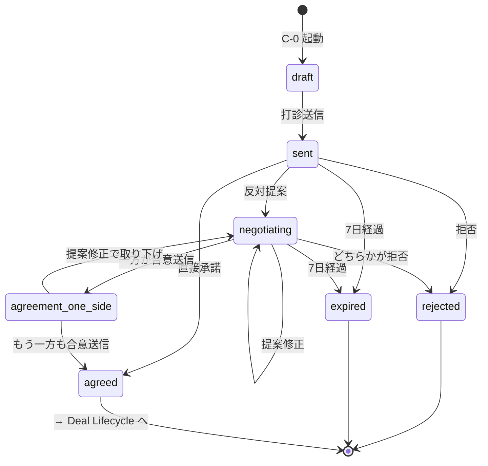
```mermaid
stateDiagram-v2
    [*] --> draft: C-0 起動
    draft --> sent: 打診送信

    sent --> rejected: 拒否
    sent --> agreed: 直接承諾
    sent --> negotiating: 反対提案
    sent --> expired: 7日経過

    negotiating --> negotiating: 提案修正
    negotiating --> rejected: どちらかが拒否
    negotiating --> agreement_one_side: 一方が合意送信
    negotiating --> expired: 7日経過

    agreement_one_side --> agreed: もう一方も合意送信
    agreement_one_side --> negotiating: 提案修正で取り下げ

    rejected --> [*]
    expired --> [*]
    agreed --> [*]: → Deal Lifecycle へ
```

### 状態定義

| 状態 ID | 表示名 | 意味 | 主画面 |
|---|---|---|---|
| `draft` | 下書き | C-0 で編集中（DBには未登録 or `status=draft`） | C-0 |
| `sent` | 送信済 | 受諾者の判断待ち | C-1 受信側 |
| `negotiating` | ネゴ中 | 提案修正のやりとり中 | C-1.5 |
| `agreement_one_side` | 一方合意済 | 一方が合意送信、他方待ち | C-1.5（mine-agreed scenario） |
| `agreed` | 合意済 | 双方合意・取引成立 | → Deal Lifecycle |
| `rejected` | 拒否済 | terminal | — |
| `expired` | 期限切れ | terminal、再打診で新規作成 | C-1.5（expired scenario） |

### 主要トリガー

| from → to | トリガー | 主体 | 画面 |
|---|---|---|---|
| `[*] → draft` | C-0 起動（マッチカードから「打診する」） | 提案者 | ホーム → C-0 |
| `draft → sent` | 「打診を送る」CTA | 提案者 | C-0 |
| `sent → agreed` | 「承諾する」 | 受諾者 | C-1 受信 |
| `sent → rejected` | 「拒否する」 | 受諾者 | C-1 受信 |
| `sent → negotiating` | 「反対提案する」 | 受諾者 | C-1 受信 |
| `negotiating → agreement_one_side` | 「合意して受諾」→確認モーダルOK | どちらか | C-1.5 |
| `agreement_one_side → agreed` | 残った片方も「合意して受諾」 | 残った人 | C-1.5 |
| `* → expired` | 最終アクションから 7日経過 | システム | バックグラウンド |

### ビジネスルール

- **期限**: 各「最新提案バージョン」から 7日経過で `expired`
- **延長**: `negotiating` ステートでのみ「+7日延長」可能、何回でも（iter30）
- **リマインド**: 3日目（lavender系バナー）と 6日目（warn系バナー）に通知＋画面内バナー
- **提案修正**: `negotiating` 中の提案修正でも 7日カウントは**継続**（リセットしない）　※要確認
- **再開**: `expired` から再度打診したい場合は新規 `draft` 作成
- **24時間無応答での自動拒否は廃止**（旧仕様、iter30）
- **市場残数の確保（iter153）**: `agreed` に到達した時点で、`sender_have_ids` / `receiver_have_ids` の数量をマッチング市場の残数から差し引く。マイ在庫の表示数量はこの時点では減らさず、取引完了承認時に実在庫を減算する。
- **キャパ超過防止（iter153）**: `agreed` へ遷移する直前に、双方の譲在庫について `quantity - 合意済み未完了予約数 >= proposal qty` を満たすことを検証する。不足している場合は合意成立させない。
- **交換手段（iter168.71, iter168.82）**: Proposal は `exchange_method='hand'`（現地交換）、`exchange_method='mail'`（郵送交換）、`exchange_method='both'`（現地・郵送どちらも対応可）を持つ。
- **現地交換の入力条件**: `exchange_method='hand'` または `exchange_method='both'` の時は、送信前に待ち合わせの入力を必須とする。
- **郵送交換の入力条件**: `exchange_method='mail'` または `exchange_method='both'` の時は、送信者が住所登録済みであることを送信前に確認する。受信者も合意までに住所登録が必要。
- **住所の開示タイミング**: 住所は `agreed` になるまで相手へ見せず、合意後に当事者同士だけへ表示する。
- **合意時の交換手段固定（iter168.97）**: `exchange_method='both'` の打診に応じる時は、合意前に `hand` または `mail` のどちらか1つを選び、選択した値で Proposal を固定する。
- **合意時の待ち合わせ候補固定（iter168.97）**: 現地交換で候補が複数ある場合は、合意前に候補を1つ選び、選択候補を `meetup_start_at/end_at/place_name/lat/lng` と `meetup_candidates` にミラーする。
- **逆打診 / 再打診（iter168.97）**: 条件を変えたい場合は、元 Proposal の提示物・受け取り候補・待ち合わせ候補・交換手段をコピーした新しい打診作成画面へ遷移し、元 Proposal を直接 mutate しない。

### 関連画面

- C-0 提示物選択（draft 編集）
- C-1 打診送信／受信
- C-1.5 ネゴチャット（normal / reminder3 / reminder6 / expired / mine-agreed）
- 合意確認モーダル（agreement_one_side 直前）
- 取引成立画面（agreed 直後）

### 関連ファイル

- `Megrum/propose-select.jsx`
- `Megrum/c-flow.jsx`（C-1）
- `Megrum/nego-flow.jsx`（C-1.5、合意確認、成立画面）

---

## 2. Deal Lifecycle

合意成立した取引の、当日〜完了まで。
入口は Proposal Lifecycle の `agreed`、出口は `rated`（完了）または `cancelled`、または `disputed`（→ Dispute Lifecycle）。
現行の図は **現地交換フローを主軸** にしており、郵送交換は当面ビジネスルールで扱う。発送済み / 受取済み の専用状態を切るかは未確定。

### 状態図

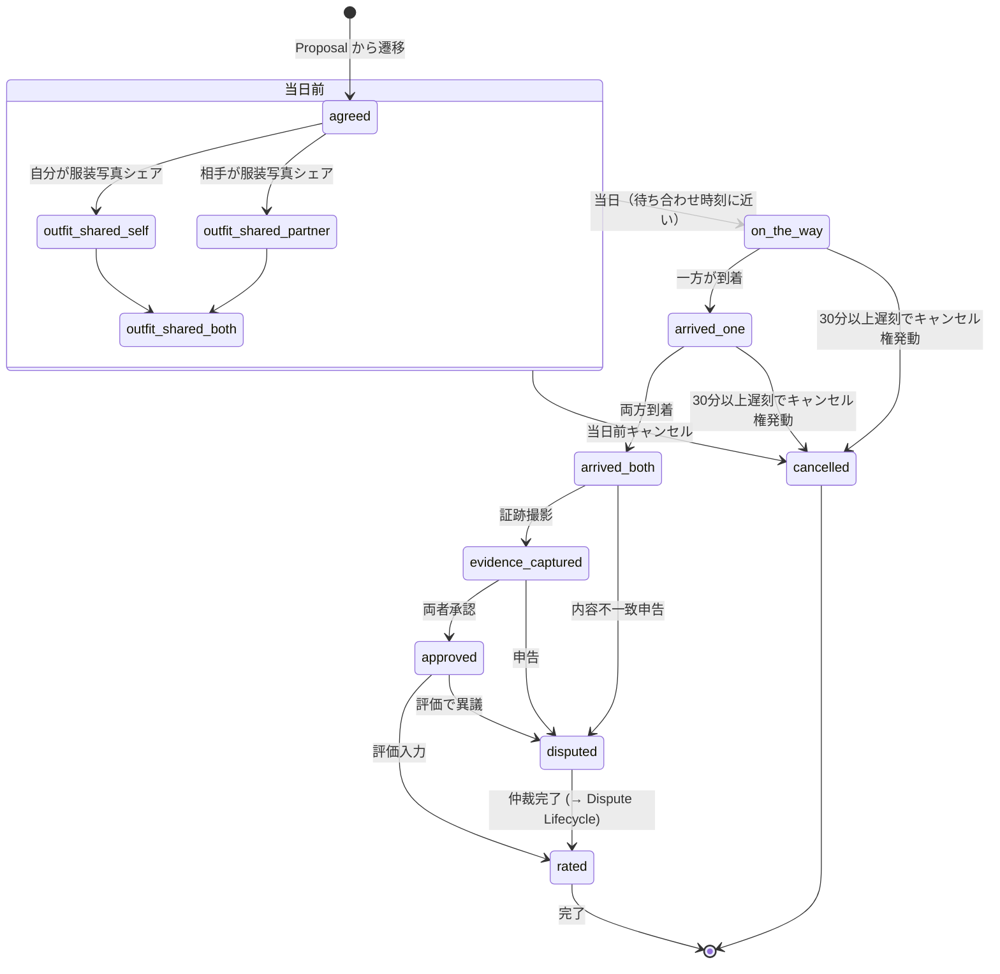
```mermaid
stateDiagram-v2
    [*] --> agreed: Proposal から遷移

    state "当日前" as pre {
      agreed --> outfit_shared_self: 自分が服装写真シェア
      agreed --> outfit_shared_partner: 相手が服装写真シェア
      outfit_shared_self --> outfit_shared_both
      outfit_shared_partner --> outfit_shared_both
    }

    pre --> on_the_way: 当日（待ち合わせ時刻に近い）
    on_the_way --> arrived_one: 一方が到着
    arrived_one --> arrived_both: 両方到着

    arrived_both --> evidence_captured: 証跡撮影
    evidence_captured --> approved: 両者承認
    approved --> rated: 評価入力
    rated --> [*]: 完了

    pre --> cancelled: 当日前キャンセル
    on_the_way --> cancelled: 30分以上遅刻でキャンセル権発動
    arrived_one --> cancelled: 30分以上遅刻でキャンセル権発動

    arrived_both --> disputed: 内容不一致申告
    evidence_captured --> disputed: 申告
    approved --> disputed: 評価で異議

    disputed --> rated: 仲裁完了 (→ Dispute Lifecycle)
    cancelled --> [*]
```

### 状態定義

| 状態 ID | 表示名 | 意味 |
|---|---|---|
| `agreed` | 合意済 | 取引成立、当日待ち |
| `outfit_shared_self` | 自分のみ服装写真済 | 部分状態 |
| `outfit_shared_partner` | 相手のみ服装写真済 | 部分状態 |
| `outfit_shared_both` | 両者服装写真済 | 部分状態 |
| `on_the_way` | 移動中 | 当日に現在地共有開始 |
| `arrived_one` | 一方到着 | 片方が会場到着 |
| `arrived_both` | 両者到着 | 合流可能 |
| `evidence_captured` | 証跡撮影済 | 両者の品物を1枚に撮影 |
| `approved` | 両者承認済 | 内容OK |
| `rated` | 評価済 | terminal（完了） |
| `disputed` | dispute中 | → Dispute Lifecycle |
| `cancelled` | キャンセル済 | terminal |

### ビジネスルール

- **服装写真共有**: 任意だが推奨。C-2 で目立つCTA（iter34）
- **現在地共有**: 任意だが当日推奨（iter34）
- **遅刻SLA**: 待ち合わせ時刻から30分超過で相手側にキャンセル権発動（iter20）
- **本人確認**: QRコード相互スキャン（C-2 ヘッダーから）
- **証跡撮影レイアウト**: 「左=相手 / 右=自分」固定（確定設計）
- **両者承認**: 双方ともOKで `approved`、片方NGで `disputed`
- **評価**: 1-5 stars＋コメント、片方が先でもOK、両者完了で `rated`

### 関連画面

- C-2 取引チャット（agreed〜arrived_both）
- C-3 証跡撮影（evidence_captured 直前）
- C-3 両者承認（approved 直前）
- C-3 評価（rated 直前）

### 関連ファイル

- `Megrum/c-flow.jsx`（C-2 ChatScreen, C-3 CompleteScreen）

---

## 3. Dispute Lifecycle

取引異常時の異議申し立てフロー（D-flow）。

### 状態図

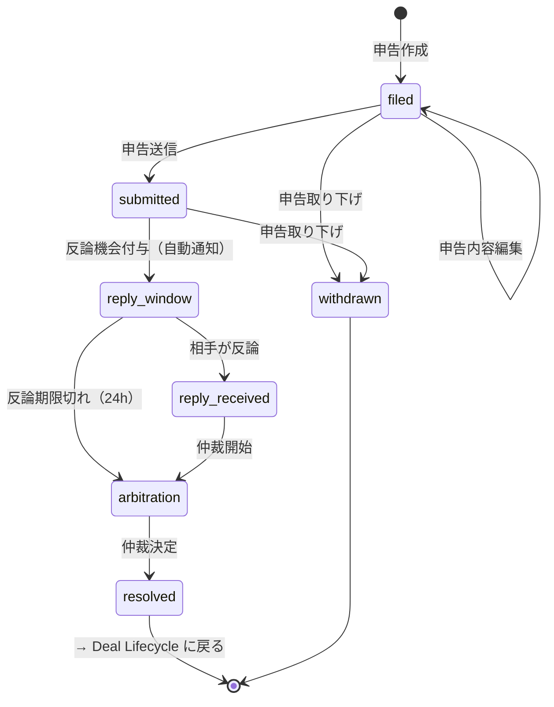
```mermaid
stateDiagram-v2
    [*] --> filed: 申告作成
    filed --> filed: 申告内容編集
    filed --> submitted: 申告送信
    filed --> withdrawn: 申告取り下げ

    submitted --> reply_window: 反論機会付与（自動通知）
    submitted --> withdrawn: 申告取り下げ

    reply_window --> reply_received: 相手が反論
    reply_window --> arbitration: 反論期限切れ（24h）

    reply_received --> arbitration: 仲裁開始
    arbitration --> resolved: 仲裁決定
    resolved --> [*]: → Deal Lifecycle に戻る

    withdrawn --> [*]
```

### 状態定義

| 状態 ID | 表示名 | 意味 |
|---|---|---|
| `filed` | 申告作成中 | 下書き |
| `submitted` | 申告送信済 | 反論待ち |
| `reply_window` | 反論機会期間 | 24h or 4h |
| `reply_received` | 反論受領 | 仲裁前 |
| `arbitration` | 仲裁中 | 運営対応 |
| `resolved` | 仲裁決定済 | → Deal Lifecycle |
| `withdrawn` | 申告取り下げ | terminal |

### ビジネスルール

- **5種カテゴリ**: ドタキャン／遅刻／不一致／破損／その他（iter12）
- **仲裁SLA**: 当日4h、それ以外24h（iter13）
- **凍結**: 申告中は両者とも新規打診不可（iter14、共に新規のみ）
- **反論機会付与**: submit と同時に相手に通知（iter15）
- **受付番号**: 採番（iter16）
- **24h残時間カウンタ**: 表示（iter17）
- **書き方のコツ**: filing 時にアドバイス表示（iter18）

### 関連画面

- D-flow（10画面、c-dispute.jsx）

### 関連ファイル

- `Megrum/c-dispute.jsx`
- `Megrum/Megrum Dispute Flow _standalone_.html`

---

## 4. AW Lifecycle

Activity Window = 「私はこの時間ここにいる」予定。場所＋時間枠。

### 状態図

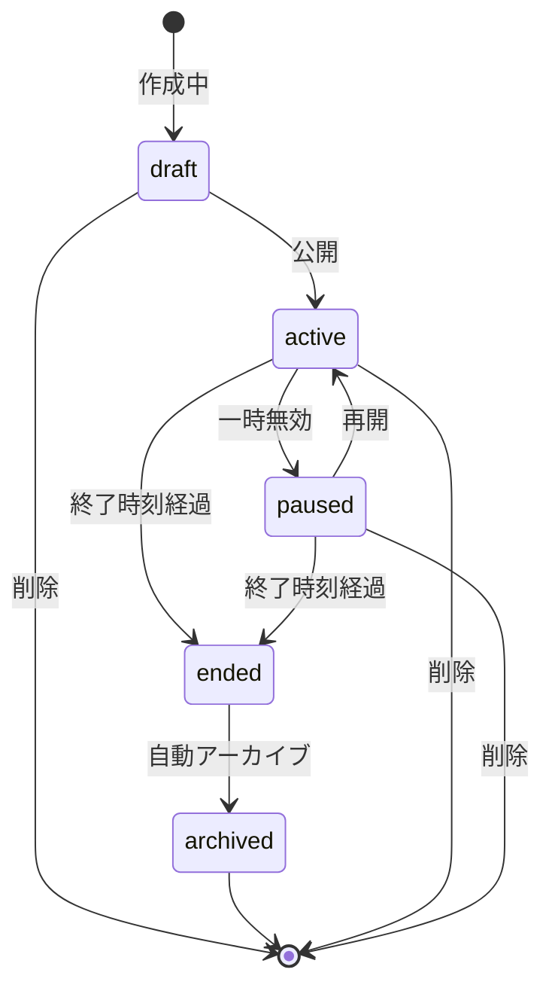
```mermaid
stateDiagram-v2
    [*] --> draft: 作成中
    draft --> active: 公開
    draft --> [*]: 削除

    active --> paused: 一時無効
    paused --> active: 再開

    active --> ended: 終了時刻経過
    paused --> ended: 終了時刻経過

    ended --> archived: 自動アーカイブ
    archived --> [*]

    active --> [*]: 削除
    paused --> [*]: 削除
```

### 状態定義

| 状態 ID | 表示名 | 意味 |
|---|---|---|
| `draft` | 下書き | 編集中 |
| `active` | アクティブ | 公開中（マッチング対象） |
| `paused` | 一時無効 | マッチング対象外 |
| `ended` | 終了 | 時間経過後 |
| `archived` | アーカイブ済 | 自動アーカイブされた |

### ビジネスルール

- **AW自動登録**: C-0 で「日時指定」＋「AW自動登録」チェックでカスタム日時から作成（iter33）
- **マッチング**: 双方の `active` AW が時間・場所で重なるとマッチ候補
- **一時無効**: 急用などで使えない時にpause、復活は resume（iter15 系の AW 仕様）
- **アーカイブ**: 終了から 24h（？要確認）で自動アーカイブ
- **編集案①／②**: 事前計画／当日現地 両方の編集経路を維持（確定設計）

### 関連画面

- AW 編集画面
- C-0 待ち合わせタブ（日時指定モードでAW候補リスト表示）

### 関連ファイル

- `Megrum/aw-edit.jsx`
- `Megrum/propose-select.jsx`（meetup タブ）

---

## 5. Item Lifecycle

在庫アイテム（譲・自分用キープ）のライフサイクル。

### 状態図

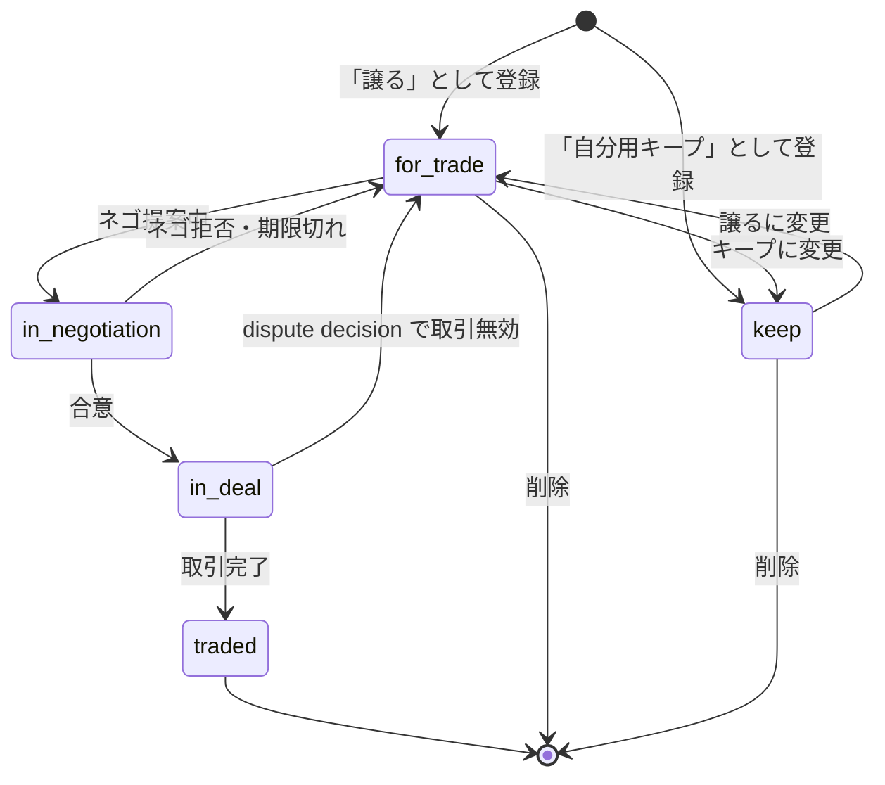
```mermaid
stateDiagram-v2
    [*] --> for_trade: 「譲る」として登録
    [*] --> keep: 「自分用キープ」として登録

    keep --> for_trade: 譲るに変更
    for_trade --> keep: キープに変更

    for_trade --> in_negotiation: ネゴ提案中
    in_negotiation --> for_trade: ネゴ拒否・期限切れ
    in_negotiation --> in_deal: 合意

    in_deal --> traded: 取引完了
    in_deal --> for_trade: dispute decision で取引無効

    traded --> [*]
    for_trade --> [*]: 削除
    keep --> [*]: 削除
```

### 状態定義

| 状態 ID | 表示名 | 意味 |
|---|---|---|
| `for_trade` | 譲る候補 | 公開中・打診対象 |
| `keep` | 自分用キープ | 譲らず保持 |
| `in_negotiation` | 提案中 | 1件以上のネゴで使用中 |
| `in_deal` | 取引中 | 合意済 deal で確保 |
| `traded` | 譲り済 | 過去ログ |

### ビジネスルール

- **複数提案OK**: 同じアイテムが複数のネゴで `in_negotiation` 同時可能
- **合意で確定**: `in_deal` になると他のネゴで自動的に「使用不可」表示
- **traded 表示**: B-1 の「過去に譲った」サブビューで参照（iter19.5）
- **数量管理**: アイテムは `qty` を持ち、提案ごとに `selectedQty` を割り当てる（iter29）
- **市場残数（iter153）**: `for_trade` のマッチング対象数は、実在庫 `quantity` から `status='agreed'` の打診で未完了承認の譲数量を差し引いた値。`sent` / `negotiating` / `agreement_one_side` はまだ差し引かない。
- **表示数量との分離（iter153）**: マイ在庫では実在庫 `quantity` を表示し続ける。ホーム、打診作成、個別募集作成・編集では市場残数を数量上限として使う。
- **traded の不変性（iter154.18）**: 「過去に譲った」アイテムは取引履歴の整合性を保つため、B-1 ではタップ時に詳細表示のみ行う。更新・削除は UI とサーバーアクションの両方で拒否する。

### 関連画面

- B-1 在庫一覧
- B-2 撮影フロー
- C-0 提示物選択（譲側）

### 関連ファイル

- `Megrum/b-inventory.jsx`
- `Megrum/propose-select.jsx`

---

## 6. Wish Lifecycle

求めているグッズの管理。

### 状態図

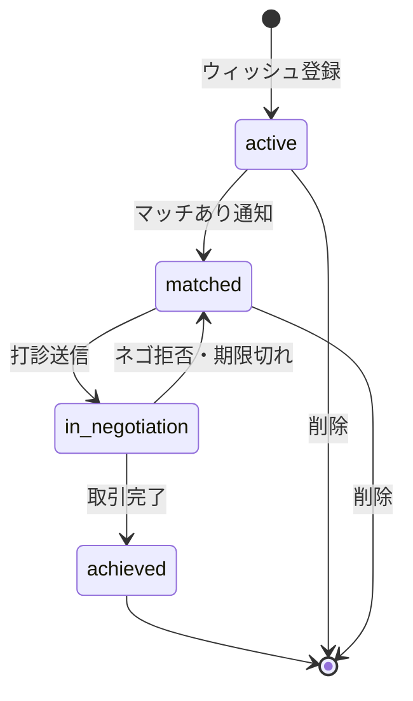
```mermaid
stateDiagram-v2
    [*] --> active: ウィッシュ登録
    active --> matched: マッチあり通知
    matched --> in_negotiation: 打診送信
    in_negotiation --> matched: ネゴ拒否・期限切れ
    in_negotiation --> achieved: 取引完了

    achieved --> [*]
    active --> [*]: 削除
    matched --> [*]: 削除
```

### 状態定義

| 状態 ID | 表示名 | 意味 |
|---|---|---|
| `active` | 探し中 | 検索対象 |
| `matched` | マッチあり | 候補あり通知済 |
| `in_negotiation` | 打診中 | ネゴ中 |
| `achieved` | 達成 | 取引完了で入手済 |

### ビジネスルール

- **flexibility / priority カラム**: ウィッシュは「絶対欲しい／妥協可」の柔軟度と優先度を持つ（既存スキーマ）
- **コレクション表示**: wish ベースで影絵→入手済の図鑑（iter19.7-9）
- **コンプリート目標は否定**: 「全種コンプ」を強制しない設計（ユーザー判断）

### 関連画面

- ウィッシュタブ（hub-screens.jsx）
- コレクション図鑑（4画面）

### 関連ファイル

- `Megrum/hub-screens.jsx`

---

## 7. Account Lifecycle

ユーザーアカウントのライフサイクル。

### 状態図

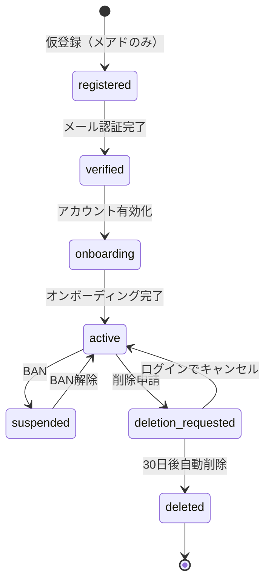
```mermaid
stateDiagram-v2
    [*] --> registered: 仮登録（メアドのみ）
    registered --> verified: メール認証完了
    verified --> onboarding: アカウント有効化
    onboarding --> active: オンボーディング完了

    active --> suspended: BAN
    suspended --> active: BAN解除

    active --> deletion_requested: 削除申請
    deletion_requested --> deleted: 30日後自動削除
    deletion_requested --> active: ログインでキャンセル

    deleted --> [*]
```

### 状態定義

| 状態 ID | 表示名 | 意味 |
|---|---|---|
| `registered` | 仮登録 | メール認証前 |
| `verified` | 認証済 | メール認証完了 |
| `onboarding` | オンボ中 | 性別→推し→メンバー→AW→完了 |
| `active` | アクティブ | 通常アカウント |
| `suspended` | 停止中 | BAN 状態 |
| `deletion_requested` | 削除申請中 | 30日猶予期間 |
| `deleted` | 削除済 | terminal |

### ビジネスルール

- **OAuth経路（Google等）**: メール認証 skip → `verified` に直行（iter20）
- **削除30日猶予**: その間にログインで `active` に復帰可能
- **オンボーディング段階**: 性別→推しグループ→メンバー→AWエリア→完了（iter20）

### 関連画面

- 認証 13画面（auth-onboarding.jsx）

### 関連ファイル

- `Megrum/auth-onboarding.jsx`

---

## 8. Listing Lifecycle

個別募集（pinpoint listing / UI 表記は **「個別募集」**）。
譲 1 件と wish 1 件を紐付けて、比率・優先度・タグを設定するピンポイント募集。
iter64 で導入予定（notes/18 §B-2）。

### 状態図

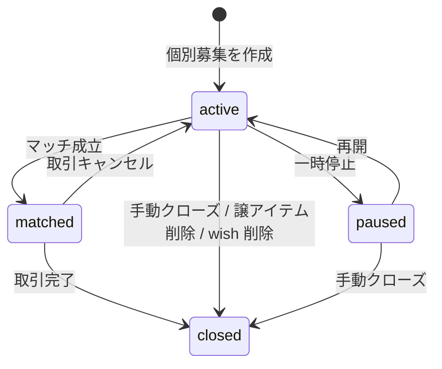
```mermaid
stateDiagram-v2
    [*] --> active: 個別募集を作成
    active --> paused: 一時停止
    paused --> active: 再開
    active --> matched: マッチ成立
    matched --> active: 取引キャンセル
    matched --> closed: 取引完了
    active --> closed: 手動クローズ / 譲アイテム削除 / wish 削除
    paused --> closed: 手動クローズ
```

### 状態定義

| 状態 | 説明 |
|---|---|
| `active` | 募集中（マッチング対象） |
| `paused` | 一時停止（マッチング対象外、UI には残る） |
| `matched` | 紐付く wish/譲が打診〜取引中 |
| `closed` | クローズ（譲削除・wish 削除・手動クローズ・取引完了） |

### 主要トリガー

- 関連 `goods_inventory` が `archived` / `traded` になったら自動 `closed`
- 関連 `goods_inventory` の譲アイテムが削除または非 active 化されたら、開いている個別募集の `have_ids` / `have_qtys` からそのアイテムを除外する。残る譲が 0 件なら `closed`。
- 関連 `user_wants` が `achieved` になったら自動 `closed`
- 取引完了（`deals.status = completed`）→ `closed`
- 取引キャンセル（cancelled）→ `active` に戻す

### ビジネスルール

- 1 個別募集 = 1 譲 × 1 wish（複数の wish を OR 対象にしたい場合は複数 listing を作る）
- 比率は `ratio_give` / `ratio_receive` ともに 1〜10
- 同じ (inventory_id, wish_id) ペアの個別募集は複数作成可能（異なる比率を試すため）
- **iter67.4 以降の実装差分**: 実装上は `have_ids[]` / `have_qtys[]` + `listing_wish_options` の「譲バンドル × 求複数選択肢」モデル。iter153 では、個別募集の譲数量も市場残数を上限にし、残数不足の条件はマッチング市場へ出さない。

---

## 9. Calendar Disclosure

打診時の「カレンダー公開」フラグのライフサイクル。iter65（Phase D）で導入。

### 状態図

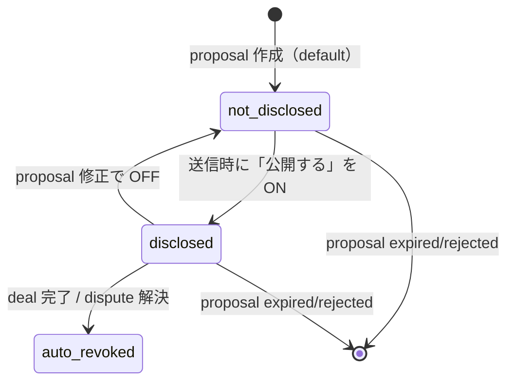
```mermaid
stateDiagram-v2
    [*] --> not_disclosed: proposal 作成（default）
    not_disclosed --> disclosed: 送信時に「公開する」を ON
    disclosed --> not_disclosed: proposal 修正で OFF
    disclosed --> auto_revoked: deal 完了 / dispute 解決
    not_disclosed --> [*]: proposal expired/rejected
    disclosed --> [*]: proposal expired/rejected
```

### 状態定義

| 状態 | 説明 |
|---|---|
| `not_disclosed` | `proposals.expose_calendar = false`（既定） |
| `disclosed` | `proposals.expose_calendar = true`、相手が overlay でスケジュールを見られる |
| `auto_revoked` | 取引完了時に自動的に閲覧不可。`expose_calendar` は履歴として `true` のまま、RLS で制御 |

### ビジネスルール

- `expose_calendar = true` のとき、相手は `schedules` を読める（RLS で許可）。AW はマッチング演算用で、重ね見の主対象にしない
- ただし、関連する `deals` のステータスが `completed` / `disputed_resolved` などの terminal になったら、RLS で閲覧を遮断する
- 閲覧側は **スケジュール重ね見 UI**（自分と相手の `schedules` を時系列で重ね描画）で候補時間を確認
- iter168.97 以降、スケジュールには任意の `place_name` を持たせ、重ね見画面や待ち合わせ候補登録時の背景表示に使う

---

## 10. Local Mode

ホーム画面の「現地交換に切り替え」モードの状態管理。
iter63（Phase B）で導入。`user_local_mode_settings` テーブルで永続化。

### 状態図

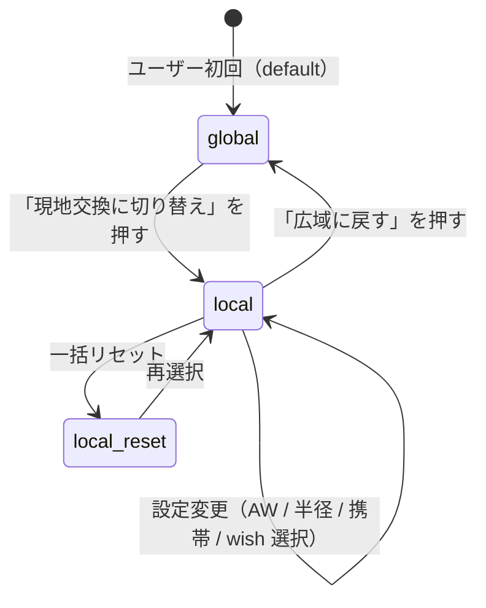
```mermaid
stateDiagram-v2
    [*] --> global: ユーザー初回（default）
    global --> local: 「現地交換に切り替え」を押す
    local --> global: 「広域に戻す」を押す
    local --> local: 設定変更（AW / 半径 / 携帯 / wish 選択）
    local --> local_reset: 一括リセット
    local_reset --> local: 再選択
```

### 状態定義

| 状態 | 説明 |
|---|---|
| `global` | 広域マッチ表示（時空無制限） |
| `local` | 現地マッチ表示（AW + 携帯 + 選択 wish） |
| `local_reset` | 携帯グッズ・wish 選択をすべてクリアした直後の状態（local の sub-state） |

### 主要トリガー

- モード ON 時: `last_lat` / `last_lng` を **GPS から毎回上書き**
- モード ON 時: `aw_id` / `radius_m` / `selected_carrying_ids` / `selected_wish_ids` は前回値を保持
- 一括リセット: `selected_carrying_ids = '{}'` / `selected_wish_ids = '{}'`

### ビジネスルール

- 1 ユーザー 1 モード設定（複数同時保持しない）
- 位置情報の取得失敗時は前回値で代替（フォールバック）
- AW 削除時: 該当 `aw_id` を null に戻す
- 現地交換モード ON 中に現地交換を含む打診を作成する場合、待ち合わせ候補に現在時刻から30分の枠と現在地を初期候補として自動追加する

---

## 11. Meguri Message Lifecycle

推しすれ違い機能のめぐりメッセージ状態管理。
iter157 で体験プロトタイプを iOS 版に追加し、iter162.41 でレター表記からLINE風のメッセージUIへ変更した。交換・打診・取引とは独立したソーシャル体験として扱う。

### 状態図

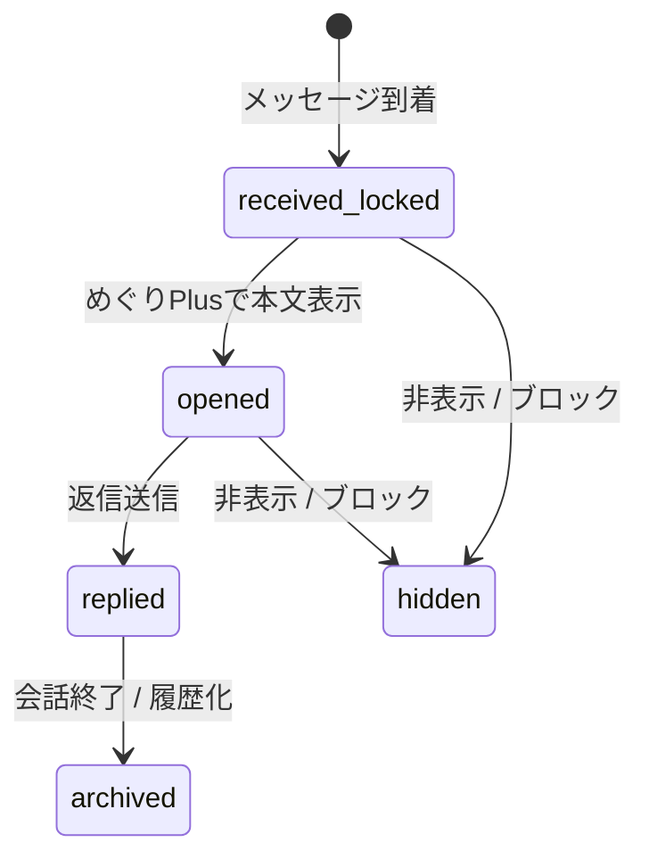
```mermaid
stateDiagram-v2
    [*] --> received_locked: メッセージ到着
    received_locked --> opened: めぐりPlusで本文表示
    opened --> replied: 返信送信
    received_locked --> hidden: 非表示 / ブロック
    opened --> hidden: 非表示 / ブロック
    replied --> archived: 会話終了 / 履歴化
```

### 状態定義

| 状態 | 説明 |
|---|---|
| `received_locked` | 到着は見えるが本文は未表示。推し傾向・ぼかした場所/時刻・相性のみ表示 |
| `opened` | 月額プランで本文を表示済み。返信導線が有効 |
| `replied` | ユーザーが返信済み。以後は個別チャットとして扱う |
| `hidden` | ユーザーが非表示・ブロックした状態 |
| `archived` | 会話終了または履歴化した状態 |

### ビジネスルール

- 単発の本文表示チケットは作らず、月額1000円のめぐりPlusのみで本文表示・返信を許可する。
- 送信側は月2通まで無料。めぐりPlusでは新規メッセージを月20通まで送れる。
- 実装上のめぐりPlus判定は `user_entitlements(feature_key='meguri_plus', active=true)` を参照する。無料ユーザーには `meguri_messages` の本文・画像パスを直接返さず、専用RPCでロック済みメタ情報だけ返す。
- 場所と時刻は必ず丸め、正確な地点・時刻・職場や生活導線の特定につながる表示は避ける。
- 交換・打診・取引とは独立し、`proposal` / `deal` 状態へ自動遷移しない。

---

## 12. Groom Lifecycle

めぐり機能の「グルーム」投稿状態管理。
iter162.49 で、インスタグラムのストーリーに近い一過性スナップとして追加。フォロー関係ではなく、めぐりあった人・同じ現場圏内という場所と時間の文脈で閲覧できる。

### 状態図

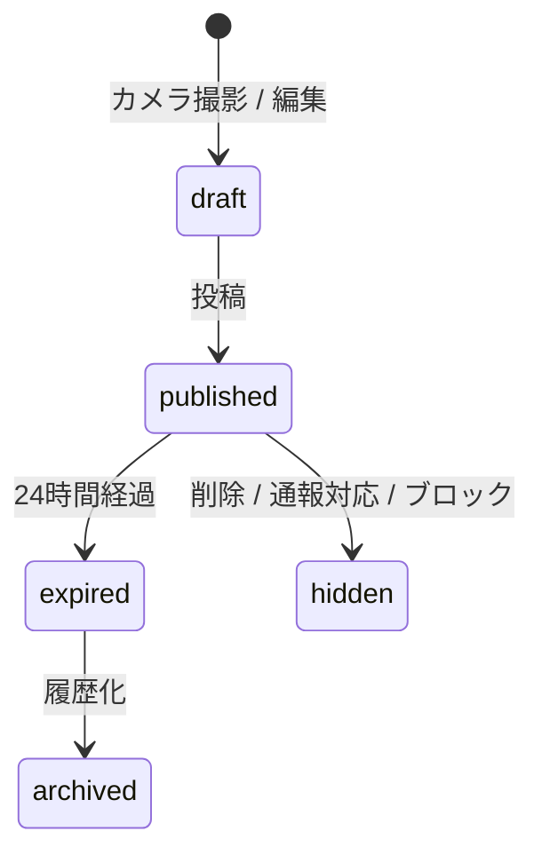
```mermaid
stateDiagram-v2
    [*] --> draft: カメラ撮影 / 編集
    draft --> published: 投稿
    published --> expired: 24時間経過
    published --> hidden: 削除 / 通報対応 / ブロック
    expired --> archived: 履歴化
```

### 状態定義

| 状態 | 説明 |
|---|---|
| `draft` | 撮影後、投稿前に写真とひとことを確認している状態 |
| `published` | めぐりあった人に表示される状態。丸いアイコンと全画面ビューアで閲覧できる |
| `expired` | 24時間経過で通常閲覧できなくなった状態 |
| `hidden` | 投稿者削除、通報対応、ブロック関係により非表示になった状態 |
| `archived` | 履歴・分析用に保存された状態。通常ユーザーには表示しない |

### ビジネスルール

- ホーム一覧の表示対象は現在地から1km圏内の投稿に限定し、フォロー/フォロワー関係を前提にしない。
- グルームマップでは、位置情報を持つ投稿を丸アイコンとして地図上に表示する。1km圏内の投稿だけ内容を開け、1km圏外の投稿をタップした場合は「1km圏外のグルームは見れません」と案内する。
- 投稿時に `origin_lat/origin_lng` を保存する。画面には正確な位置を出さず、`place_hint` の丸めた表示だけを使う。
- 場所と時刻は必ず丸め、正確な現在地・生活導線・滞在時刻を特定できる表示にしない。
- グルームへの返信は、めぐりメッセージ導線へつなげる。交換・打診・取引へは自動遷移しない。
- iter165 以降、`encountered_people` の閲覧は `audience_user_ids` に含まれるユーザーだけに制限する。空配列を公開フィード扱いにしない。
- `groom-posts` Storage は private bucket とし、`can_view_groom_post()` を満たす投稿だけ署名URLを発行する。
- 例外として、`groom_replies.groom_snapshot.image_path` に残した投稿画像は、投稿が期限切れ/アーカイブ済みでも返信スレッド参加者だけ署名URLを発行できる。
- `published` の通常表示は `expires_at > now()` の投稿だけに限定する。アプリ起動時/復帰時に `expire_groom_posts()` を呼び、pg_cron が利用できる環境では15分間隔でも期限切れ投稿を `expired`、期限切れから7日経過した投稿を `archived` へ進める。
- いいねは `groom_reactions`、閲覧済みは `groom_views`、返信は `groom_replies` に保存する。返信は `notifications.kind='groom_reply'` を作り、めぐりメッセージで開いた時に `groom_replies.read_at` を更新する。
- グルーム返信後の通常会話は `meguri_messages` に保存し、`notifications.kind='meguri_message'` を作る。受信者が会話を開いた時に `meguri_messages.read_at` を更新する。
- ユーザー単位の非表示は `groom_hidden_posts`、ブロックは `groom_user_blocks`、通報は `groom_reports` に保存し、RLSとアプリフィードの両方で表示対象から除外する。
- 初期実装は写真1枚 + ひとこと + いいね + メッセージ入力を対象にし、動画・公開範囲の細分化は後続検討とする。

---

## 13. Meguri Board Lifecycle（スポット掲示板）

めぐり内のスレッド型掲示板。交換成立そのものではなく、現地の情報共有・雑談・列状況・導線共有を扱う。

### 状態図

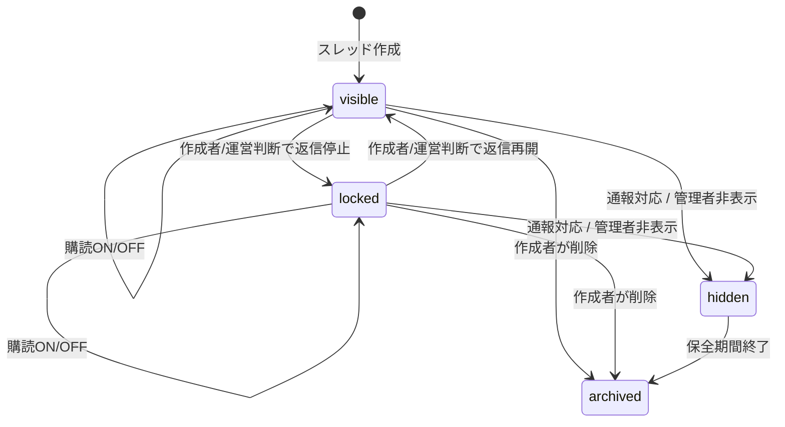
```mermaid
stateDiagram-v2
    [*] --> visible: スレッド作成
    visible --> visible: 返信追加
    visible --> visible: 購読ON/OFF
    visible --> locked: 作成者/運営判断で返信停止
    locked --> locked: 購読ON/OFF
    locked --> visible: 作成者/運営判断で返信再開
    visible --> archived: 作成者が削除
    locked --> archived: 作成者が削除
    visible --> hidden: 通報対応 / 管理者非表示
    locked --> hidden: 通報対応 / 管理者非表示
    hidden --> archived: 保全期間終了
```

### 状態定義

| 状態 | 説明 |
|---|---|
| `visible` | 公開範囲に入るユーザーが一覧・詳細で閲覧できる状態 |
| `locked` | 閲覧はできるが返信追加を止めた状態。作成者または運営が再開できる |
| `hidden` | 通報対応や管理者判断で通常表示から外した状態 |
| `archived` | 保全・分析用に残し、通常ユーザーには表示しない状態 |

### ビジネスルール

- 新規スレッドの公開範囲は `nearby_3km` / `same_prefecture` の2択。
- `nearby_3km` はスレッド作成時の `origin_lat/origin_lng` を基準に、閲覧者の現在地から3km以内なら表示する。
- `same_prefecture` はスレッド作成時の都道府県を基準に、閲覧者がスポット掲示板で選んだ都道府県と一致する場合に表示する。
- スポット掲示板の都道府県は初回のみプロフィールの都道府県を既定値にし、ユーザーが画面内で変更した後は端末保存値を次回以降の既定値にする。
- めぐりホームでは3km圏内のスレッドを一覧表示する。掲示板マップでは位置情報を持つスレッドを地図上に表示し、3km圏内または都道府県単位で閲覧可能なものだけ詳細へ進める。
- iter172 以降、自分のスレッドはタイトル/本文/カテゴリを編集でき、締め切り/再開/削除ができる。削除は `archived` へのソフト削除。
- iter172 以降、自分の返信は編集でき、削除時は `meguri_board_replies.status='deleted'` としてプレースホルダ表示にする。
- iter173 以降、返信は他の返信を引用できる。引用は `parent_reply_id` と表示用スナップショットを保存し、引用元が編集・削除されても会話の文脈を保つ。
- iter173 以降、スレッド詳細内で返信本文・引用本文・返信者名を対象に検索できる。検索は表示絞り込みで、スレッド状態は変えない。
- iter185 以降、削除されていない返信はiOS共有シートへ渡せる。共有は表示操作であり、スレッド/返信の状態は変えない。
- iter183 以降、掲示板一覧とスレッド詳細はプル更新で最新状態を再取得できる。更新中も既存表示は維持し、取得後に一覧/返信を差し替える。
- iter174 以降、スレッド作成者と返信者は `meguri_board_thread_subscriptions.notification_enabled=true` で自動購読される。ユーザーは一覧/詳細から通知ON/OFFを切り替えられる。
- iter174 以降、購読中スレッドに自分以外が返信すると `notifications.kind='meguri_board_reply'` を作成し、通知タップで該当スレッドへ戻れるようにする。通知OFFのユーザーと返信者本人には送らない。
- iter175 以降、返信本文の `@handle` は掲示板メンションとして解釈する。本人以外かつ対象スレッドを閲覧できるユーザーには `notifications.kind='meguri_board_mention'` を作成し、通常の購読返信通知とは重複させない。
- iter184 以降、返信アクションから「メンションして返信」を選ぶと返信入力欄へ対象ユーザーの `@handle` を挿入する。削除済み返信、自分の返信、`locked` スレッドでは挿入しない。
- iter176 以降、スレッドと返信は最大4枚の画像を添付できる。画像は `meguri-board-media` private Storage path として保存し、閲覧可能なスレッド/返信を取得した後だけ署名URLで表示する。
- iter182 以降、スレッド詳細内の添付画像はタップで全画面プレビュー表示できる。これは表示状態のみで、スレッド/返信の状態は変えない。
- iter178 以降、ユーザーをブロックすると `groom_user_blocks` に保存し、相互にスポット掲示板のスレッド/返信を表示しない。ブロック関係にある相手のスレッドには返信できず、その相手からの掲示板返信通知・メンション通知も作成しない。
- iter171 以降、スレッドにはカテゴリ（質問/情報/雑談/交換/落とし物）、検索、並び替え（更新/新着/人気/保存）、保存、参考になった、既読、ユーザー単位の非表示、通報を持たせる。
- iter181 以降、掲示板一覧では `自分` 表示を選ぶと `thread.mine=true` のスレッドだけを表示する。検索・カテゴリ絞り込みとは同時に適用する。
- iter186 以降、掲示板一覧では `未読` 表示を選ぶと `read_at` がない、または `read_at < latest_activity_at` のスレッドだけを表示する。
- スレッド詳細を開いたら `meguri_board_thread_reads.read_at` を更新し、一覧では `read_at < latest_activity_at` を未読として扱う。
- 保存・参考になった・非表示・通報はユーザー単位で保存する。非表示にしたスレッドは本人の一覧から除外する。
- iter179 以降、通報は即送信ではなく理由選択を挟む。理由は `spam` / `harassment` / `privacy` / `unsafe` / `off_topic` / `other` のいずれかを `meguri_board_reports.reason` に保存する。
- iter180 以降、スレッド作成中・返信中の内容は端末内下書きとして自動保存する。投稿/返信成功時は該当下書きを削除し、空の下書きは保持しない。
- スレッドは打診・取引チャットへ自動遷移しない。必要ならユーザープロフィールやグッズ交換導線から別フローで開始する。
- 正確な緯度経度は画面に表示しない。表示上は「3km圏内」「都道府県」などの丸めた文言だけを使う。

---

## 14. Admin / Billing Lifecycle（管理者・有料権限）

iter166 で、管理者ページ・管理者権限・Premium等の有料権限を実装するための状態を追加した。
管理者の操作は必ず `admin_audit_logs` に記録し、ユーザー側の有料機能判定は `subscriptions` の生状態ではなく `user_entitlements` の集約結果を見る。

### AdminRole 状態図

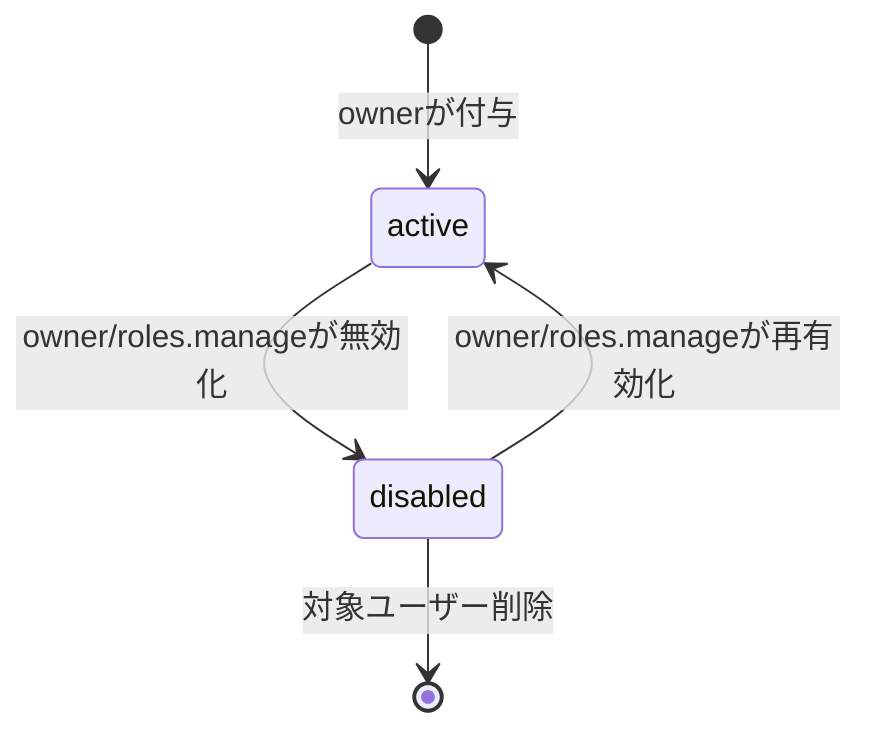
```mermaid
stateDiagram-v2
    [*] --> active: ownerが付与
    active --> disabled: owner/roles.manageが無効化
    disabled --> active: owner/roles.manageが再有効化
    disabled --> [*]: 対象ユーザー削除
```

| 状態 | 説明 |
|---|---|
| `active` | 管理者ページへアクセス可能。`requires_mfa=true` の場合は AAL2 セッション必須 |
| `disabled` | 管理者権限は保持されるがアクセス不可。履歴確認用に行は残す |

### Subscription / Entitlement 状態図

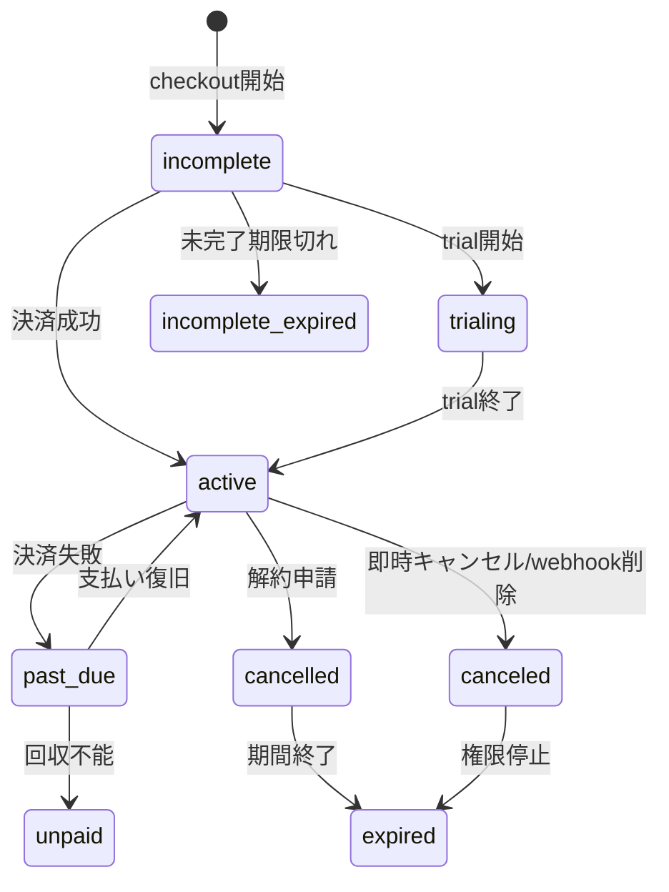
```mermaid
stateDiagram-v2
    [*] --> incomplete: checkout開始
    incomplete --> active: 決済成功
    incomplete --> trialing: trial開始
    incomplete --> incomplete_expired: 未完了期限切れ
    trialing --> active: trial終了
    active --> past_due: 決済失敗
    past_due --> active: 支払い復旧
    past_due --> unpaid: 回収不能
    active --> cancelled: 解約申請
    cancelled --> expired: 期間終了
    active --> canceled: 即時キャンセル/webhook削除
    canceled --> expired: 権限停止
```

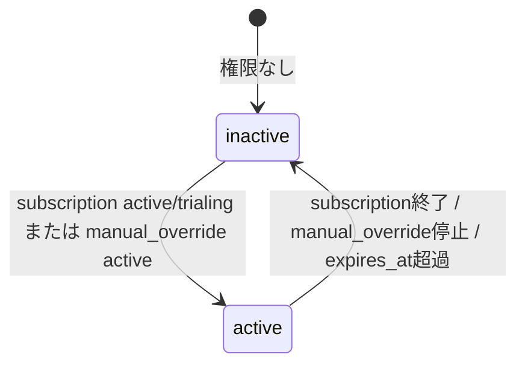
```mermaid
stateDiagram-v2
    [*] --> inactive: 権限なし
    inactive --> active: subscription active/trialing または manual_override active
    active --> inactive: subscription終了 / manual_override停止 / expires_at超過
```

| エンティティ | 状態 | 説明 |
|---|---|---|
| `subscriptions` | `incomplete` / `incomplete_expired` / `trialing` / `active` / `past_due` / `cancelled` / `canceled` / `unpaid` / `expired` | Stripe等プロバイダー由来の契約状態 |
| `user_entitlements` | `active=true/false` | アプリが参照する最終的な機能権限。`feature_key='premium'` がPremium判定、`feature_key='meguri_plus'` がめぐりPlus判定 |
| `stripe_webhook_events` | `processing` / `processed` / `failed` / `ignored` | webhook処理の冪等性・再処理判断 |

### ビジネスルール

- 管理者の追加・更新は `roles.manage` 権限が必要。最後の `owner` を無効化・降格してはいけない。
- `requires_mfa=true` の管理者は Supabase Auth の AAL2 セッションでのみ管理者ページへ入れる。
- ユーザー停止・権限変更・有料権限手動上書きは、理由入力を必須にし `admin_audit_logs` に保存する。
- Stripe webhook は `stripe_webhook_events.event_id` で重複処理を防ぎ、`subscriptions` 更新後に plan_type に応じて `user_entitlements(feature_key='premium' | 'meguri_plus')` を upsert する。
- 手動上書きは `plan_overrides` に履歴を残し、同時に `user_entitlements` を更新する。

## 15. 付録：エンティティ間の関係

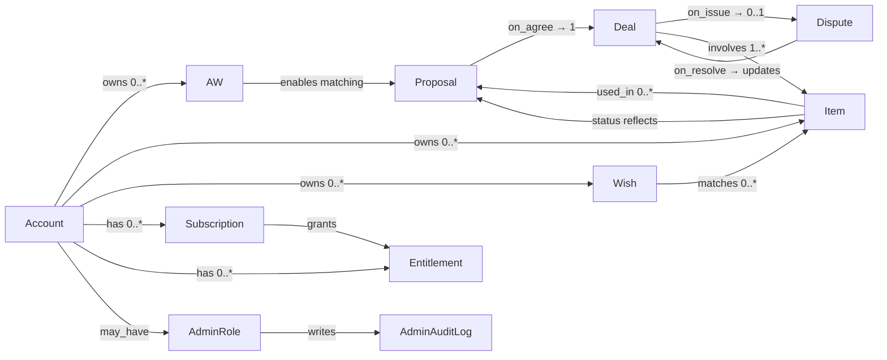
```mermaid
graph LR
    Account -->|owns 0..*| AW
    Account -->|owns 0..*| Item
    Account -->|owns 0..*| Wish
    Account -->|has 0..*| Subscription
    Account -->|has 0..*| Entitlement
    Account -->|may_have| AdminRole
    AW -->|enables matching| Proposal
    Item -->|used_in 0..*| Proposal
    Wish -->|matches 0..*| Item
    Proposal -->|on_agree → 1| Deal
    Deal -->|on_issue → 0..1| Dispute
    Dispute -->|on_resolve → updates| Deal
    Deal -->|involves 1..*| Item
    Item -->|status reflects| Proposal
    Subscription -->|grants| Entitlement
    AdminRole -->|writes| AdminAuditLog
```

### 関係性メモ

- **1 Proposal = 1 Deal**: 合意成立時点で Proposal は確定、以降は Deal のライフサイクル
- **1 Deal = 0..1 Dispute**: 1つの取引につき申告は最大1件（重複申告は不可）
- **1 Item は複数 Proposal で `in_negotiation`** だが、`in_deal` になれるのは1つだけ
- **1 Account は複数 AW を持てる**（過去・未来含めて）

---

## 未確定・要確認項目

実装着手前にユーザーと擦り合わせる項目。`05_data_model.md` の末尾「⚠️ 未確定項目」とも連携。

### ✅ iter39 で確定済

| # | 項目 | 確定内容 |
|---|---|---|
| 9 | Item の `kind=keep` は `status=in_negotiation` に遷移しうるか？ | **確定：完全分離・ならない**。譲りたくなったら `kind` を `for_trade` に変更してから |
| 12 | 到着検知の仕組み | **確定：MVPは手動のみ**。QR/GPSはPost-MVP |
| 15 | `meetup_scheduled_custom` を JSONB か別テーブルか | **確定：JSONB（MVP段階）**。将来切り出し可能 |
| 16 | `outfit_photo` を messages か専用テーブルか | **確定：両方**。専用テーブルで最新管理＋messagesにシステムメッセージで足跡 |
| - | `disputes.resolution.decision` 値リスト | **確定：5値（sender_fault/receiver_fault/mutual_fault/no_fault/cant_determine）+ penalty 4段階** |

### 状態遷移ルール関連（残）

| # | 項目 | 状況 |
|---|---|---|
| 1 | ネゴ中の提案修正で 7日カウントはリセットされるか？ | **要確認**（現状は継続前提で記述） |
| 2 | AW の `ended` から `archived` への自動遷移時間（24h？） | **要確認** |
| 3 | dispute の反論機会期間が 24h or 4h はカテゴリで変わるか？ | **要確認** |
| 4 | アカウント削除30日猶予の起点は申請時刻 or 日付ベース？ | **要確認** |
| 5 | Wish の `matched` 状態は1回通知するだけか、継続的に？ | **要確認** |
| 6 | Proposal の `cancelled` 状態を追加するか（送信前取消・送信後 sender 取消等）？ | **要確認** |
| 7 | `agreement_one_side` 中の提案修正で `agreed_by_*` を reset するか？ | **要確認** |
| 8 | `disputed` 解決時に `rated` に戻るか別の終了状態か？ | **要確認** |
| 10 | Item の `traded` 後に `kind` を保持か reset か？ | **要確認** |
| 11 | `auto_from_proposal` で作られた AW は、対応する deal が cancel/dispute になった時に削除？保持？ | **要確認** |

### 検知・トリガー関連（残）

| # | 項目 | 状況 |
|---|---|---|
| 13 | マッチング計算のバッチ頻度（毎日 / 6h / 1h） | **要確認** |
| 14 | リアルタイム通知のスロットル（同じユーザー間で1日N回まで等） | **要確認** |

### データ構造関連（残）

| # | 項目 | 状況 |
|---|---|---|
| 17 | `proposal_revisions` の履歴保存粒度（毎修正全部 vs 直近N件） | **要確認** |
| 18 | system message の `event_type` 値リスト確定（'arrival', 'agreement_one_side', 'outfit_shared' 等） | **要確認** |
| 19 | 郵送交換を Deal の別状態（`shipped` / `received` 等）として切るか、既存状態で扱うか | **要確認** |
| 20 | 郵送交換で、受信者の住所登録を `agreed` 前のどの時点で必須化するか | **要確認** |

これらは実装着手前にユーザーと擦り合わせる項目。詳細は `05_data_model.md` の「⚠️ 未確定項目」表を参照。
