# 78. RN実画面スクショ対応表

> 目的: `mobile/` の実際の React Native 画面を見た目から逆引きして、対応する RN ファイルと Swift 移行先をすぐ特定するための表。
>
> 取得条件:
> - 2026-06-01
> - `mobile/` Preview build
> - iPhone 17 Simulator
> - Welcome から `画面だけプレビューする` で入った Preview データ

## 使い方

1. 見た目が近いスクショを探す
2. `RN元` を実装比較元にする
3. `Swift先` を修正対象にする
4. 指示は 1 画面 1 論点に絞る

---

## 主要画面

| 画面 | スクショ | RN元 | Swift先 | 見分けポイント |
|---|---|---|---|---|
| ホーム | 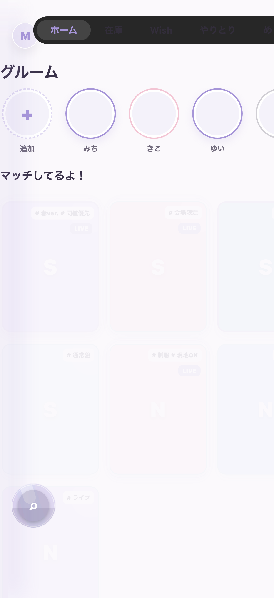 | `mobile/app/(tabs)/index.tsx` | `ios-native/Sources/MegrumApp/HomeScreen.swift` | 上にグルーム、中央に `マッチしてるよ！` と `交換できるかも？` のカード群 |
| 検索 | 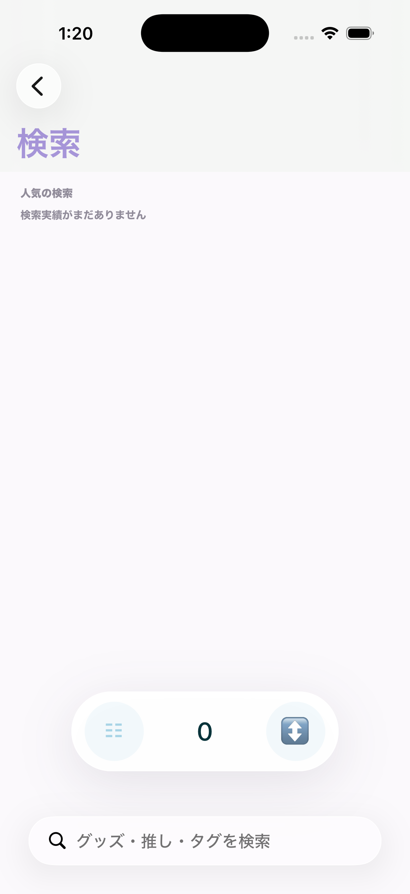 | `mobile/app/search.tsx` | `ios-native/Sources/MegrumApp/SearchScreen.swift` | 左上に戻る、下部に検索バー、中央に結果件数とフィルター導線 |
| 関係図 | 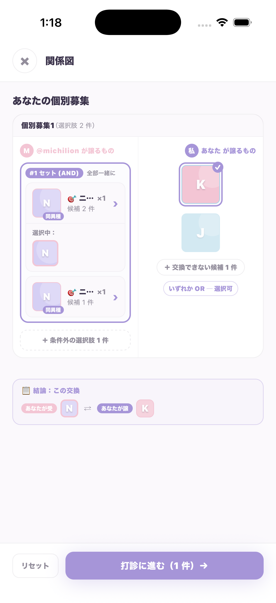 | `mobile/app/match-detail.tsx` | `ios-native/Sources/MegrumApp/MatchRelationScreen.swift` | タイトルが `関係図`、左右の候補パネル、下に `打診に進む` |
| 打診作成 STEP1 | 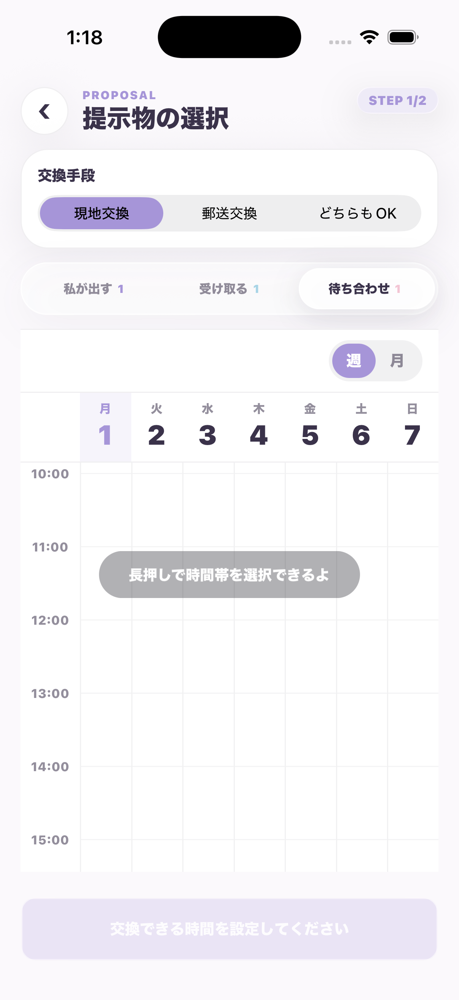 | `mobile/app/proposal-select.tsx` | `ios-native/Sources/MegrumApp/ProposalCreateFlow.swift` | `PROPOSAL / STEP 1/2`、交換手段切替、`私が出す / 受け取る / 待ち合わせ` タブ |
| 待ち合わせカレンダー月表示 | 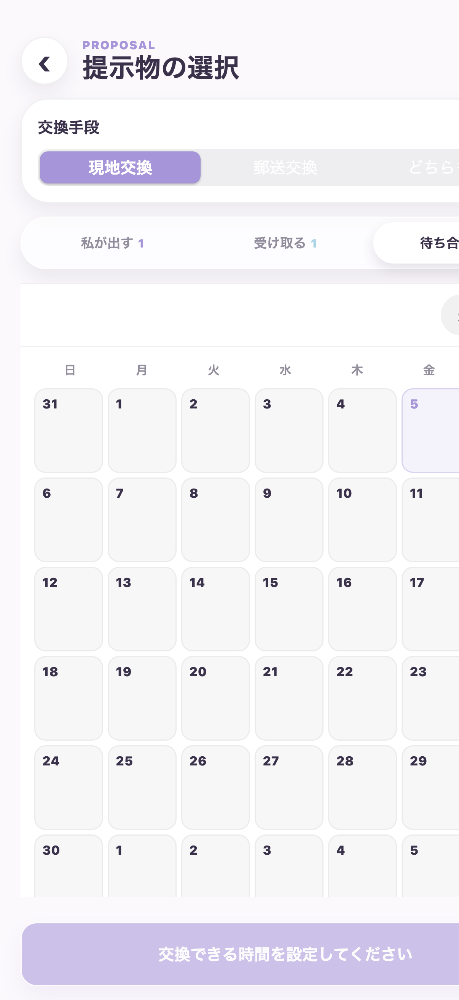 | `mobile/app/proposal-select.tsx` | `ios-native/Sources/MegrumApp/ProposalMeetupCalendarEditor.swift` | `待ち合わせ` タブ内の `週 / 月` 切替、7列月グリッド、日付タップで週表示へ戻る |
| 送信確認 | 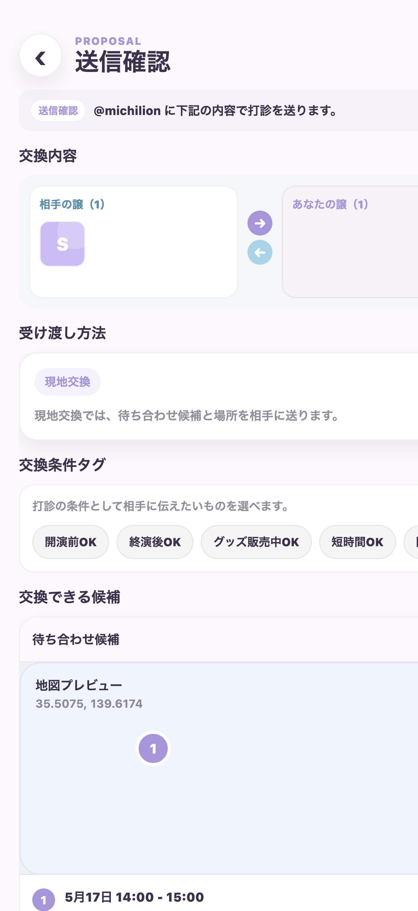 | `mobile/app/proposal-confirm.tsx` | `ios-native/Sources/MegrumApp/ProposalCreateFlow.swift` | `PROPOSAL / STEP 2/2`、交換内容、受け渡し方法、条件タグ、候補、メッセージ、スケジュール共有 |
| 打診完了 | 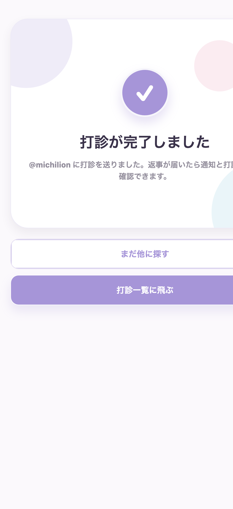 | `mobile/app/proposal-confirm.tsx` | `ios-native/Sources/MegrumApp/ProposalCreateFlow.swift` | `打診が完了しました`、`まだ他に探す`、`打診一覧に飛ぶ` の2ボタン |
| 在庫 | 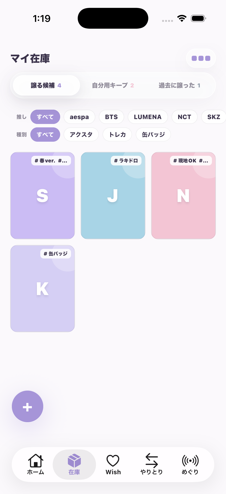 | `mobile/app/(tabs)/inventory.tsx` | `ios-native/Sources/MegrumApp/CollectionScreens.swift` | タイトル `マイ在庫`、`譲る候補 / 自分用キープ / 過去に譲った` 切替、グッズグリッド |
| ウィッシュ | 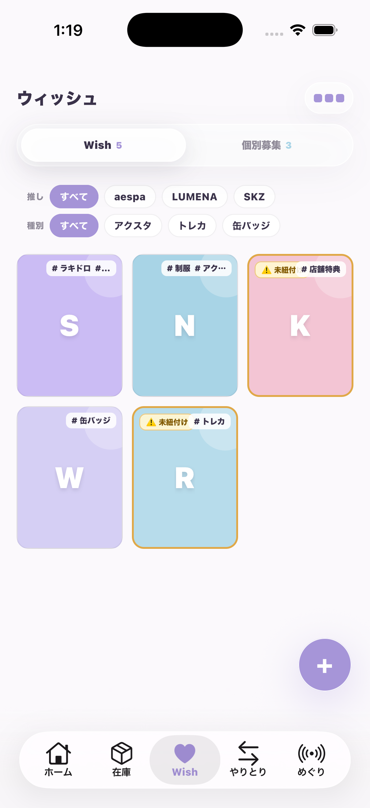 | `mobile/app/(tabs)/wishes.tsx` | `ios-native/Sources/MegrumApp/CollectionScreens.swift` | タイトル `ウィッシュ`、`Wish / 個別募集` 切替、募集デッキ表示 |
| やりとり | 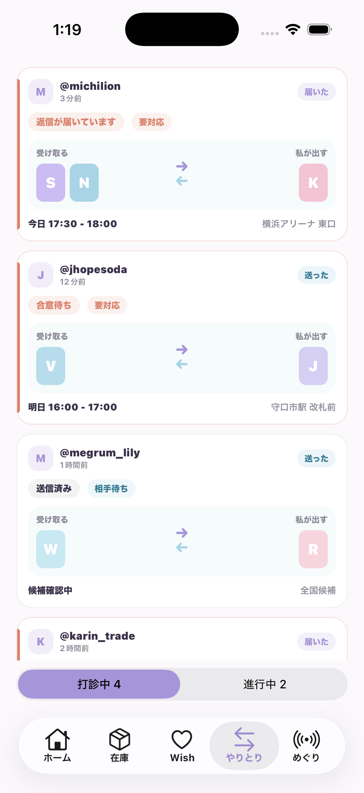 | `mobile/app/(tabs)/transactions.tsx` | `ios-native/Sources/MegrumApp/TradesScreen.swift` | 交換相手ごとの縦一覧、下部に `打診中 / 進行中` 切替 |
| めぐり | 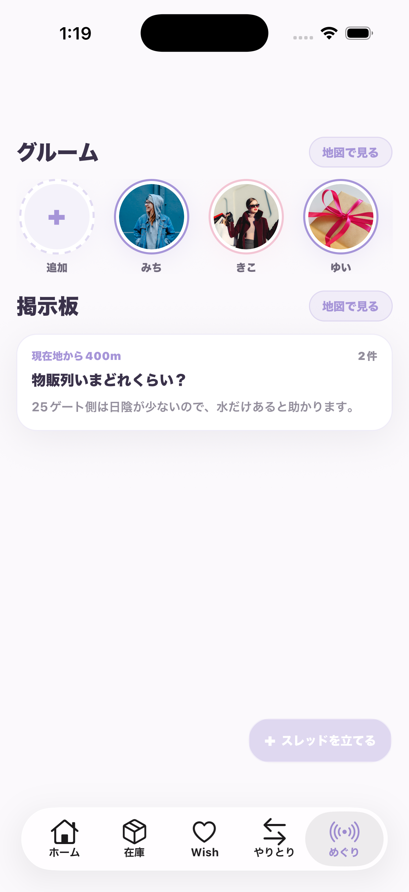 | `mobile/app/(tabs)/encounters.tsx` | `ios-native/Sources/MegrumApp/MeguriScreen.swift` | `グルーム` と `掲示板` の2セクション、各セクションに `地図で見る` |

---

## そのまま使える依頼文

```text
RN元:
mobile/app/match-detail.tsx

Swift先:
ios-native/Sources/MegrumApp/MatchRelationScreen.swift

今回やりたいこと:
RN版の候補選択と下部CTAの挙動をSwiftへ寄せたい

制約:
- iOS標準コンポーネント優先
- 仕様変更なし
- 他画面は触らない

最初にやってほしいこと:
RNとSwiftの差分を3点以内で整理してから、差分1件だけ実装して
```

## 補足

- この表は mock HTML ではなく、`mobile/` の RN Preview 実画面から取った。
- ホーム起点のRN/Swift横並び確認は `RN Swift Home Proposal Visual QA.html` を使う。関係図はSwift通常表示に加えて `swift-match-relation-candidates-expanded.png` で候補展開済み状態も比較する。
- `transaction-detail.tsx` のような詳細導線は、Preview 操作をもう一段進めれば追加で撮れる。
- 追加スクショが必要な時は、まずこの表の `RN元` を固定してから、対象画面だけ追加するのが効率的。
