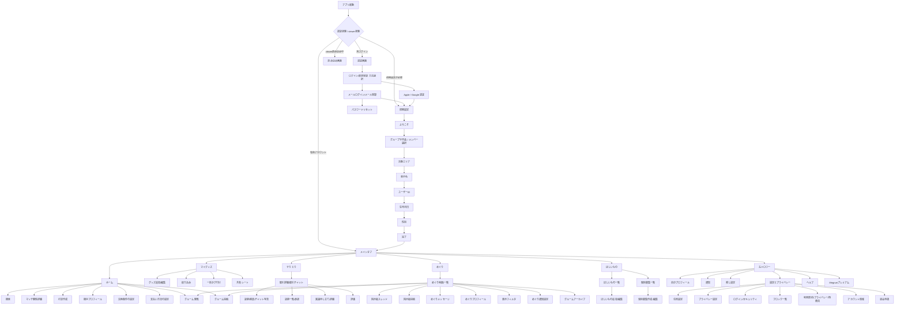
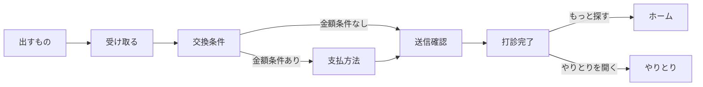

# 81. iOS画面遷移図 法務確認用

最終更新: 2026-07-10
ステータス: Draft v1.0（Swift Native現行実装から作成）

## 目的

利用規約、プライバシーポリシー、App Privacy、専門家レビューへ渡すため、Megrum iOSアプリの主要な画面遷移と、法務・プライバシー上の確認対象になりやすい入力・共有・通知・外部連携の接点を整理する。

この資料は `ios-native/` の現行Swift Native実装を正とする。旧React Native / Expo / JSXモック時代の画面一覧を含む `notes/11_screen_inventory.md` は参考資料であり、この資料の代替にはしない。

## 自動更新の方針

完全自動で正確な画面遷移図を作るのは難しい。SwiftUIでは `@State`、クロージャ、独自スライドオーバーレイ、`sheet`、`fullScreenCover`、通知リンクなどで画面が開くため、単純な静的解析では「どのユーザー操作で開くか」までは確定しにくい。

そのため運用は次の形にする。

1. `scripts/generate_ios_screen_flow_inventory.sh` で遷移面を自動抽出する。
2. 出力を見て、ルート・タブ・主要sheet/fullScreenCover・通知リンクを手で確認する。
3. この資料のMermaid図と法務確認ポイントを更新する。

抽出コマンド:

```bash
bash scripts/generate_ios_screen_flow_inventory.sh > /tmp/megrum-ios-navigation-surfaces.md
```

## 根拠にした主な実装ファイル

| 領域 | 実装ファイル |
|---|---|
| ルート分岐 | `ios-native/Sources/MegrumApp/MegrumRootView.swift`, `MegrumRootAuthenticatedContent.swift`, `MegrumRootRouting.swift` |
| 認証 | `AuthScreen.swift`, `AuthScreenModels.swift` |
| 初期設定 | `AccountSetupScreen.swift`, `AccountSetupModels.swift` |
| タブ構成 | `MegrumAuthenticatedTabsView.swift`, `MegrumAuthenticatedTabContentView.swift` |
| 左ドロワー・設定 | `AppDrawerModels.swift`, `MegrumRootDrawerDestinationSheet.swift`, `SettingsScreen.swift`, `SettingsModels.swift` |
| ホーム・検索・打診 | `HomeScreen.swift`, `HomeDiscoverySheets.swift`, `ProposalCreateFlow.swift`, `ProposalCreateModels.swift` |
| マイグッズ・ほしいもの・個別募集 | `CollectionScreens.swift`, `GoodsCollectionScreenBody.swift`, `WishCollectionScreen.swift`, `IndividualListingsScreen.swift` |
| やりとり | `TradesScreen.swift`, `TradesDetailPresentationModifier.swift`, `TradeDetailScreen.swift` |
| めぐり | `MeguriScreen.swift`, `MeguriScreenPresentationModifiers.swift`, `MeguriGroomPresentationModifiers.swift` |
| 通知リンク | `NotificationRouteIntent.swift` |

## 全体画面遷移



## 主要タブ別の確認ポイント

| タブ/領域 | 主な画面 | 法務・プライバシー上の確認ポイント |
|---|---|---|
| 認証 | ログイン、新規登録、メール認証、Apple/Google、パスワードリセット | メールアドレス、外部認証、認証リダイレクト、セッション保存、リンク共有時のリスク |
| 初期設定 | 推し設定、活動エリア、表示名、ユーザーID、生年月日、性別 | 生年月日・性別・活動エリアの利用目的、未成年/年齢制限、プロフィール公開範囲 |
| ホーム | 候補表示、検索、マッチ関係詳細、打診作成 | レコメンド/候補表示、外部AI/検索の有無、候補表示が保証でないこと、打診内容 |
| マイグッズ | グッズ追加/編集、写真、タグ、一括タグ付け、共有 | 写真、顔/人物候補、外部ブラウザ/Google Lens導線、SNS共有、削除/アーカイブ |
| ほしいもの/個別募集 | ほしいもの、個別募集、交換条件、郵送条件 | 求めるグッズ、現地/郵送条件、送料・発送目安、会員間条件の責任範囲 |
| やりとり | 打診一覧、取引チャット、証跡、評価、異議申し立て | 取引メッセージ、写真、証跡、評価、通報/異議、相手への住所/支払情報開示タイミング |
| めぐり | 地図、掲示板、グルーム、メッセージ、通知設定 | 位置情報、近距離公開、掲示板UGC、画像投稿、メッセージ、通知本文、ブロック/通報 |
| 設定 | 通知、住所、支払方法、退会、法務表示 | 住所・支払方法・通知ON/OFF・退会申請・データ削除/保持・公開法務ページ同期 |

## 打診作成フロー

`ProposalCreateStep` の現行ステップ:



補足:

- 旧ステップ名として残る `meetup`、`shipping`、`payment` は実装上の互換を含む。現行UIでは `meetup` / `shipping` は `交換条件` に寄せられている。
- 打診作成はホーム候補、相手プロフィール、個別募集、再打診など複数の入口から開く。
- 現地交換、郵送交換、金額条件、支払方法、メッセージ、待ち合わせ候補は規約・プライバシーポリシーで説明対象になり得る。

## 通知・ディープリンク

通知やリンクは `NotificationRouteIntent` で次のように画面へ解決される。

| linkPath例 | 遷移先 |
|---|---|
| `/home`, `/profile`, `/search` | ホーム |
| `/inventory`, `/goods` | マイグッズ |
| `/wish`, `/wishes` | ほしいもの |
| `/proposals/{id}`, `/trades/{id}`, `/transaction-detail?id=...` | やりとり詳細 |
| `/trades/{id}/capture`, `/transaction-capture?id=...` | 証跡撮影導線 |
| `/trades/{id}/approve`, `/transaction-approve?id=...` | 証跡承認導線 |
| `/trades/{id}/rate`, `/transaction-rate?id=...` | 評価導線 |
| `/disputes/{id}`, `/dispute-detail?id=...` | 異議申し立て詳細 |
| `/meguri-board-thread?id=...` | めぐり掲示板スレッド |
| `/meguri-messages`, `/meguri-letters/{userID}` | めぐりメッセージ |
| `/grooms`, `/groom?id=...` | グルーム閲覧 |
| `/users/{id}`, `/user-profile?id=...` | 相手プロフィール |

法務確認ポイント:

- 通知本文はロック画面に表示され得る。
- linkPathやqueryには画面遷移に必要なIDが含まれる。
- 認証リンク、通知リンク、外部ブラウザ、スクリーンショット共有時のリスク説明が必要。

## 専門家へ渡す時の注記

- 本資料はユーザーが見る主要画面と遷移の説明資料であり、DBテーブル・API・全状態遷移の正本ではない。
- 状態遷移の正本は `notes/09_state_machines.md`、用語の正本は `notes/10_glossary.md`。
- 法務原典との差分管理は `notes/17_legal_alignment.md`。
- 画面名は実装クラス名ではなく、専門家が読みやすいユーザー向け名称へ寄せている。
- 広告、IAP、外部AI、Google Lens、通知、位置情報、住所、支払方法は、リリース時の有効/無効設定と実装状態を別途再確認する。

